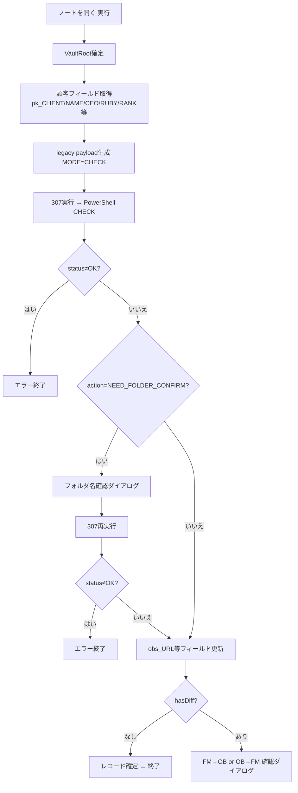
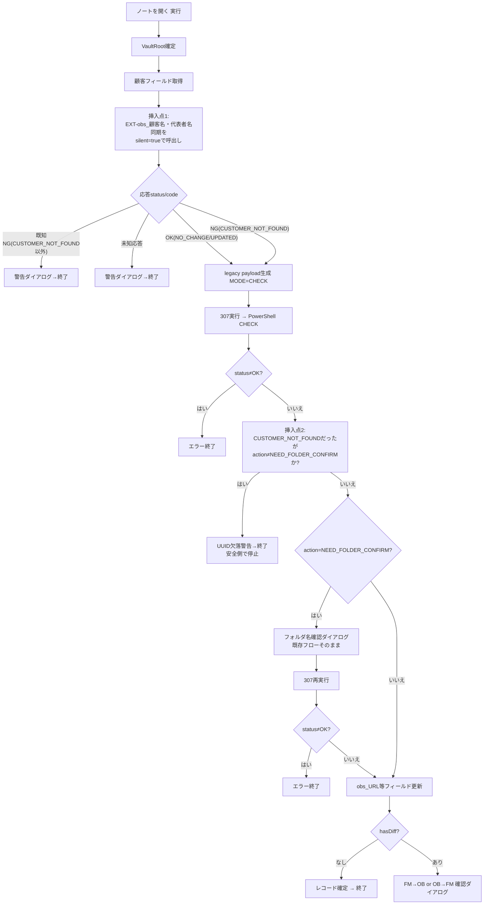

# UUID先行同期を EXT-obs_OBSノート-開く へ統合する設計書

作成日: 2026-07-29 / 作成者: Claude Cowork
状態: **設計のみ。実装・転記・E2Eは一切行っていない。ChatGPTレビュー待ち。**

対象2スクリプトの実機変更・転記は一切行っていない。本文書はread-only調査に基づく設計と、
実装に進む場合の「FileMakerスクリプトへの転記用差分案」までを提出するものである。

---

## 0. read-only調査で確認した前提事実

### 0.1 現行`EXT-obs_OBSノート-開く`の実処理順序（全文確認済み）

1. `エラー処理[オン]`
2. `$noteType = Get(スクリプト引数)`。空なら即エラー終了。
3. VaultRoot確定（`z_sysClientPC::OB_VAULTPATH`/`OB_VAULTNAME`優先、無ければ`Get(ドキュメントパス)`から生成）。空なら即エラー終了。
4. `$pk_CLIENT`/`$companyNameRaw`/`$CEO`/`$RUBY`/`$RANK`/`$obs_RELPATH`/`$obs_URL`/`$fm_LASTMODIFIED`を`顧客`テーブルから取得。
5. `$pk_CLIENT`または`$companyNameRaw`が空なら即エラー終了。
6. **legacy payload（`MODE=CHECK`, `VaultRoot`/`noteType`/`pk_CLIENT`/`companyNameRaw`/`CEO`/`RUBY`/`RANK`/`obs_RELPATH`/`obs_URL`/`fm_LASTMODIFIED`/`MIGRATE_LEGACY`）を`JSONSetElement`で生成。**
7. `EXT-obs_内部CallPS-PAYLOAD`(id 307)を実行し、`$stdout`をPIPE形式（`|`区切り）として解析。`$status`/`$action`取得。
8. `$status ≠ "OK"` なら即エラー終了。
9. `$action = "NEED_FOLDER_CONFIRM"` なら候補提示ダイアログ→`folderNameConfirmed`を付与して307を再実行→再度`$status`チェック。
10. `obs_URL`/`obs_RELPATH`/`obs_LASTKNOWNWRITE`/`obs_LASTSYNCAT`フィールドを応答値で更新。
11. `$diffJson`（Base64デコード）の`hasDiff`が0/空ならレコード確定して終了（同期完了）。
12. `hasDiff`があれば`recommend.winner`（FM/OB）に応じてFM→OB確認ダイアログ、またはOB→FM確認ダイアログ（CEO/RUBYのみ、NAME/RANKは保護）。

**重要な確認事実**：この現行スクリプトには「名前ベースの顧客フォルダ検索」処理そのものは**含まれていない**。名前検索（`Normalize-ForMatch`によるフォルダ照合、および`NEED_FOLDER_CONFIRM`の判定）は、すべて`FM-Obsidian-Bridge-Payload.ps1`側で、`MODE=CHECK`のpayloadを受け取った**直後**（`UPDATE_CUSTOMER_IDENTITY`分岐の次、`$VaultRoot`確定〜`$custRoot`検索）に実行される。つまり「名前検索より前」の唯一の挿入点は、**手順6（legacy payload生成・307呼出し）より前**である。

### 0.2 PowerShell側の関連実装（read-only確認済み）

- `Normalize-ForMatch`は`株式会社`/`(株)`/`（株）`/`㈱`および`有限会社`/`(有)`/`（有）`/`㈲`を**完全除去**した上で`Sanitize-LeafName`する関数。既存フォルダ名・検索対象名の両方に適用され、比較前に会社種別表記の差異を完全に吸収する。
- `Invoke-UpdateCustomerIdentity`内のフォルダ改名先決定は `$newFolderName = Sanitize-LeafName $companyNameRaw "NO_NAME"`。**素の会社名をそのまま使用**し、`Normalize-ForMatch`のような会社種別表記の除去は行わない。
- この2つの命名規則の違い（UUID同期側は素の会社名、legacy検索側は会社種別表記を除去して比較）があっても、`Normalize-ForMatch`は**比較の両辺**に適用されるため、UUID同期によるリネーム後もlegacy名前検索は問題なく照合できる。**したがって、UUID同期後に新フォルダパスを明示的に引き継がなくても、legacy検索は正しく動作する**（詳細は第7章）。
- `EXT-obs_顧客名・代表者名同期`は、FileMaker側フィールドへの書き戻しを一切行わない（Obsidian一方向）。今回の統合でも、この性質は変わらない。

---

## 1. 現行処理フロー図



---

## 2. 推奨統合後フロー図



挿入点は2箇所。挿入点1は「名前検索（＝legacy payload生成・307呼出し）より前」という当初要求どおりの位置。挿入点2は、第8章のCUSTOMER_NOT_FOUND仲裁ロジックに必要な、legacy検索結果と組み合わせるための追加の最小挿入点である（当初の想定より1箇所多いが、要求8「既存名前検索結果と組み合わせて判断する」を満たすために必須）。

---

## 3. 変更対象スクリプトごとの最小差分一覧

### 3.1 `EXT-obs_顧客名・代表者名同期`（既に判定A済みの単独実行版が起点）

| # | 変更内容 | 位置 |
|---|---|---|
| 1 | silent引数解析ブロックを追加 | 冒頭コメント直後、顧客フィールド取得より前 |
| 2 | 既存の全ダイアログ表示ステップを`If [ not $silentMode ]`で包む | 全17箇所（第5章参照） |
| 3 | 各終了点で結果JSON(`$uciResult`)を組み立て、`現在のスクリプト終了[$uciResult]`へ変更 | 全17箇所 |

`Invoke-UpdateCustomerIdentity`相当のPowerShell呼出しロジック・payload生成・応答検証（型検証・requestId照合等）は**無変更**。

### 3.2 `EXT-obs_OBSノート-開く`

| # | 変更内容 | 位置 |
|---|---|---|
| 1 | 挿入点1：`EXT-obs_顧客名・代表者名同期`をsilent呼出しし、応答を検証・分岐 | 既存の「$pk_CLIENT/$companyNameRaw空チェック」の直後、「legacy payload生成」の直前 |
| 2 | 挿入点2：CUSTOMER_NOT_FOUND時の安全停止判定 | 既存の「$status≠OK」チェックの直後、「NEED_FOLDER_CONFIRM」判定の直前 |

既存のVaultRoot確定、legacy payload生成、307呼出し、NEED_FOLDER_CONFIRMフロー、フィールド更新、diff確認・FM↔OB同期確認ダイアログは**無変更**。

---

## 4. silent引数仕様

呼出し元が次のJSONをスクリプト引数として渡す。

```json
{ "silent": true, "caller": "EXT-obs_OBSノート-開く" }
```

`EXT-obs_顧客名・代表者名同期`冒頭（顧客フィールド取得より前）に追加する解析ロジック：

```
変数を設定 [ $scriptArgRaw ; 値: Get ( スクリプト引数 ) ]
変数を設定 [ $silentMode ; 値: False ]
変数を設定 [ $callerName ; 値: "" ]

If [ not IsEmpty ( $scriptArgRaw ) ]
  変数を設定 [ $argJsonCheck ; 値: JSONFormatElements ( $scriptArgRaw ) ]
  If [ Left ( $argJsonCheck ; 1 ) ≠ "?" ]
    変数を設定 [ $silentRaw ; 値: JSONGetElement ( $scriptArgRaw ; "silent" ) ]
    If [ Left ( $silentRaw ; 1 ) ≠ "?" and $silentRaw = "1" ]
      変数を設定 [ $silentMode ; 値: True ]
    End If
    変数を設定 [ $callerRaw ; 値: JSONGetElement ( $scriptArgRaw ; "caller" ) ]
    If [ Left ( $callerRaw ; 1 ) ≠ "?" ]
      変数を設定 [ $callerName ; 値: $callerRaw ]
    End If
  End If
End If
```

安全側デフォルト：引数なし・不正JSON・`silent`キーなし・`silent`が`"1"`以外（`false`は`"0"`として返る）は、すべて`$silentMode = False`（単独実行モード）となる。これにより、単独実行時の既存ダイアログ挙動（成果物8）は変更ロジックを一切追加せずに維持される。

`$callerName`は現時点ではログ・将来拡張用の保持のみとし、分岐条件には使用しない（未使用変数として仕様に含めるかはChatGPT確認事項とする。第12章参照）。

---

## 5. 結果返却JSON仕様

### 5.1 共通テンプレート

```
変数を設定 [ $uciResult ; 値:
  JSONSetElement ( "{}" ;
    [ "status" ; <status> ; JSONString ] ;
    [ "code" ; <code> ; JSONString ] ;
    [ "userMessage" ; <userMessage> ; JSONString ] ;
    [ "requestId" ; <requestIdまたは空文字> ; JSONString ] ;
    [ "updatedFiles" ; <updatedFilesまたは0> ; JSONNumber ] ;
    [ "folderRenamed" ; <0または1> ; JSONBoolean ]
  )
]
If [ <folderRenamed=trueの場合のみ> ]
  変数を設定 [ $uciResult ; 値: JSONSetElement ( $uciResult ; [ "oldFolder" ; $respOldFolder ; JSONString ] ; [ "newFolder" ; $respNewFolder ; JSONString ] ) ]
End If
```

全終了点で`現在のスクリプト終了 [ $uciResult ]`を使用する（silent/単独実行いずれのモードでも共通。単独実行モードでは戻り値を誰も参照しないため無害）。

### 5.2 終了点ごとのマッピング（既存17終了点。単独実行版の判定A確定内容がベース）

| 終了点 | status | code | userMessage（既存文言を流用） | 備考 |
|---|---|---|---|---|
| pk_CLIENT空 | NG | `MISSING_REQUIRED_FIELD` | 顧客レコードが確定していません。(pk_CLIENTが空です) | |
| companyNameRaw空 | NG | `MISSING_REQUIRED_FIELD` | 顧客名(NAME)が空です。同期を中止します。 | |
| vaultRoot空 | NG | `MISSING_REQUIRED_FIELD` | VaultRootが確定できません。端末設定(z_sysClientPC)を確認してください。 | |
| requestId空 | NG | `MISSING_REQUIRED_FIELD` | requestIdを生成できませんでした。 | |
| payload生成失敗 | NG | `INVALID_PAYLOAD` | payloadの生成に失敗しました。(JSONSetElementエラー) | |
| transport実行エラー | NG | `EXECUTION_FAILED` | EXT-obs_内部CallPS-PAYLOAD の実行でエラーが発生しました。(...) | |
| stdout空 | NG | `INVALID_POWERSHELL_RESPONSE` | PowerShellから応答がありませんでした。(...) | ※1 |
| JSON解析失敗 | NG | `INVALID_POWERSHELL_RESPONSE` | 応答をJSONとして解析できませんでした。(...) | ※1 |
| 必須キー欠落 | NG | `INVALID_POWERSHELL_RESPONSE` | 応答に必須キーが欠落しています。(...) | ※1 |
| 型不正 | NG | `INVALID_POWERSHELL_RESPONSE` | 応答の型が仕様と一致しません。(...) | ※1 |
| requestId不一致 | NG | `INVALID_POWERSHELL_RESPONSE` | requestIdが一致しません。(...) | ※1 |
| 既知NGコード(PowerShell由来、15件) | NG | `$respCode`（そのまま転記） | `$respUserMessage`（そのまま転記） | CUSTOMER_NOT_FOUND含む |
| 未知NGコード | NG | `INVALID_POWERSHELL_RESPONSE` | 未知のNG codeです。(...) | ※1 |
| 未知status | NG | `INVALID_POWERSHELL_RESPONSE` | 未知のstatusです。(...) | ※1 |
| oldFolder/newFolder欠落・型不正（2種） | NG | `INVALID_POWERSHELL_RESPONSE` | 既存文言のまま | ※1 |
| NO_CHANGE | OK | `NO_CHANGE` | `$respUserMessage`（そのまま） | |
| CUSTOMER_IDENTITY_UPDATED | OK | `CUSTOMER_IDENTITY_UPDATED` | 顧客情報を更新しました。(...) | updatedFiles/folderRenamed/oldFolder/newFolder付き |
| 未知code(最終フォールバック) | NG | `INVALID_POWERSHELL_RESPONSE` | 未知のcodeです。(...) | ※1 |

※1：`INVALID_POWERSHELL_RESPONSE`は、既存15件の既知NGコード一覧には含まれない**新規コード**である。ただし、プロジェクトの上位設計文書（`ChatGPT/RESTART_CHATGPT.md`／`Claude/RESTART_CLAUDE.md`第7.1節、将来の`SYNC_NOTE`汎用transport向けに定義済み）で「FileMaker transport自身が生成する7コード」の1つとしてすでに正式定義されているコード名を、意味が完全に一致するため転用した。**これは独断の新規コード発明ではなく、既存の上位コード体系からの転用である旨、ChatGPTの確認を求める**（第12章）。

---

## 6. CUSTOMER_NOT_FOUND分岐仕様

### 6.1 判断ロジック

```
挿入点1の応答:
  code = CUSTOMER_NOT_FOUND (status=NG)
    → $uciWasCustomerNotFound = True としてlegacy CHECKへ進む（停止しない）
  code = NO_CHANGE または CUSTOMER_IDENTITY_UPDATED (status=OK)
    → $uciWasCustomerNotFound = False としてlegacy CHECKへ進む
  上記以外の既知NGコード、または未知応答
    → 直ちに警告表示して終了（legacy CHECKへ進まない）

挿入点2（legacy CHECKの応答取得後）:
  $uciWasCustomerNotFound = True かつ action ≠ "NEED_FOLDER_CONFIRM"
    → 「名前ベースでは顧客フォルダが見つかったが、UUID同期では見つからなかった」
      = 既存顧客だがUUID欠落・不整合の可能性
    → 安全側で停止（警告表示、自動続行しない）
  $uciWasCustomerNotFound = True かつ action = "NEED_FOLDER_CONFIRM"
    → 名前検索でも見つからない = 真の新規顧客
    → 既存の新規フォルダ作成フローへそのまま進む（無変更）
  $uciWasCustomerNotFound = False
    → 追加判定なし。既存フローへそのまま進む。
```

### 6.2 推奨と根拠

「UUID欠落・不整合」を検出した場合の選択肢（従来処理へ進む／警告停止）について、**警告停止を推奨する**。根拠：

- プロジェクト全体の確定方針として「UUID競合時の自動選択・自動統合・自動修復は禁止」が一貫して定められている。
- 名前一致だけで同一顧客と断定して従来のCHECK/APPLY・フォルダ更新へ進めると、UUIDが本来別人格の可能性（同姓同名の別顧客、過去の重複登録等）を静かに読み替えてしまうリスクがある。
- 停止時のダイアログは「手動確認をお願いします」という趣旨に留め、原因を断定しない（本プロジェクトの一貫した方針）。

この判断は**ChatGPTの確認・承認が必要**（第12章）。

---

## 7. folderRenamed時のパス更新仕様

### 7.1 検討した案

- **案A**：同期応答の`newFolder`を、`EXT-obs_OBSノート-開く`が保持するフォルダ変数へ反映し、以降の処理で使用する。
- **案B**：同期完了後、既存のlegacy CHECK処理（`Normalize-ForMatch`による名前ベース検索）をそのまま実行させ、変更後の名前で自然に再解決させる。

### 7.2 推奨：案B

**現行`EXT-obs_OBSノート-開く`は、そもそもフォルダパスをFileMaker側変数として保持していない。** フォルダの特定は、legacy CHECK呼出し時にPowerShell側が`$payload.companyNameRaw`（＝FileMaker`顧客::NAME`の現在値）を使って`Normalize-ForMatch`で毎回検索し直す設計であるため、「旧パスを保持している」という状態自体が存在しない。

さらに、`Normalize-ForMatch`は比較対象の両辺（既存フォルダ名／検索対象名）から`株式会社`等の会社種別表記を完全除去してから比較するため、UUID同期によるフォルダ改名（`Sanitize-LeafName($companyNameRaw)`、素の会社名を使用）が行われていても、legacy検索は改名後のフォルダを問題なく照合できる（第0.2節で確認済み）。

したがって、**案Bを推奨する**。追加の変数引継ぎロジックは不要であり、挿入点1でUUID同期を実行した後、既存のlegacy CHECK呼出し（`$companyNameRaw`は挿入点1より前に取得済みの現在値をそのまま使用）を無変更で実行するだけで、正しいフォルダが解決される。これは「後方互換性・小差分・確実性」のいずれの観点からも最も優れている。

**未検証事項（限定E2Eで確認すべき）**：上記はコード読解に基づく論理的な結論であり、実機での動作確認はまだ行っていない。第11章のテストケースで確認する。

---

## 8. 単独実行互換性

`$silentMode`のデフォルトは`False`であり、`Get(スクリプト引数)`が空（＝ボタン等からの直接単独実行）の場合、silent判定ロジックのIf文はすべてスキップされ、既存のダイアログ表示ステップは`If [ not $silentMode ]`の条件を満たして従来どおり実行される。ロジック・文言・判定順序は一切変更しない。結果JSON化と`現在のスクリプト終了[$uciResult]`への変更は、単独実行時には戻り値を誰も参照しないため、外部から観測可能な挙動への影響はない。

---

## 9. 新規顧客作成フローへの非干渉確認

真の新規顧客（UUID一致ノートなし・名前一致フォルダなし）の場合：

1. 挿入点1：`code=CUSTOMER_NOT_FOUND` → 停止せずlegacy CHECKへ進む（`$uciWasCustomerNotFound=True`）。
2. legacy CHECK：名前検索でも見つからないため`action="NEED_FOLDER_CONFIRM"`が既存ロジックのまま返る。
3. 挿入点2：`$uciWasCustomerNotFound=True`だが`action="NEED_FOLDER_CONFIRM"`のため、追加した停止条件は成立しない。
4. 以降、既存の「3. フォルダ作成フロー（NEED_FOLDER_CONFIRM）」以降は完全に無変更のまま実行される。

したがって、新規顧客作成フローへの追加変更は一切なく、非干渉が設計上成立している。ただし、これも第11章のテストケースでの実機確認が必要。

---

## 10. FileMaker転記用の具体的ステップ案

第4章・第5章・第6章の内容を転記対象とする。転記時の区分は前回の単独実行版と同様に小区分へ分割することを推奨する（今回は設計提出のみのため、実際の区分別提示は次回、実装着手が承認された後に行う）。

**`EXT-obs_顧客名・代表者名同期`側の転記追加区分（案）**
- 区分0：silent引数解析（第4章）
- 区分3-1〜3-17：既存各終了点への`If [not $silentMode]`ラップ＋結果JSON組立（第5.2章の表に対応、17箇所）

**`EXT-obs_OBSノート-開く`側の転記追加区分（案）**
- 区分A：挿入点1（第6.1章前段、silent呼出しと応答仲裁）
- 区分B：挿入点2（第6.1章後段、CUSTOMER_NOT_FOUND安全停止判定）

---

## 11. 想定テストケース（限定E2E再開後に使用）

| # | シナリオ | 期待結果 |
|---|---|---|
| T1 | 既存顧客・変更なしで「ノートを開く」を実行 | 挿入点1で`NO_CHANGE`（ダイアログ非表示）→ legacy CHECKが正常続行 → 従来どおりノートが開ける |
| T2 | 既存顧客・NAME/CEO/RUBY/RANKいずれかを変更してから「ノートを開く」を実行 | 挿入点1で`CUSTOMER_IDENTITY_UPDATED`（ダイアログ非表示、フォルダ改名を含む）→ legacy CHECKが改名後フォルダを正しく検出 → 従来どおり続行 |
| T3 | 真の新規顧客（UUID一致ノートなし・同名フォルダなし）で「ノートを開く」を実行 | 挿入点1で`CUSTOMER_NOT_FOUND` → legacy CHECKが`NEED_FOLDER_CONFIRM` → 挿入点2は停止条件不成立 → 既存の新規作成フローがそのまま動作 |
| T4 | UUID欠落顧客（同名フォルダは存在するがUUIDタグなし・不一致）で「ノートを開く」を実行 | 挿入点1で`CUSTOMER_NOT_FOUND` → legacy CHECKが名前一致で`action≠NEED_FOLDER_CONFIRM` → 挿入点2で警告表示・停止（フォルダ変更・ノート更新は一切発生しない） |
| T5 | 挿入点1で既知NGコード（例：`TARGET_FOLDER_ALREADY_EXISTS`）を意図的に発生させる | 挿入点1で警告表示・即終了（legacy CHECKへ進まない） |
| T6 | 挿入点1でPowerShell応答が壊れている（意図的注入） | 挿入点1で`INVALID_POWERSHELL_RESPONSE`警告表示・即終了 |
| T7 | `EXT-obs_顧客名・代表者名同期`を単独実行（ボタン等から直接） | silent引数なし → 従来どおり成功/NO_CHANGE/NGダイアログが表示される（回帰なし） |
| T8 | 挿入点1の呼出しにより307が2回起動されることによる体感速度の確認 | 許容範囲内であることを確認（第12章のリスク参照） |

第4章記載の保持中試験資材（複製FileMaker・テストUUID・旧フォルダ・Markdown）は、これらのテストケース設計の参考にしたが、**削除・変更は一切行っていない**。

---

## 12. リスク・未決事項

1. **`INVALID_POWERSHELL_RESPONSE`コードの転用**：既存の「既知NGコード15件（確定済み）」には含まれない、上位設計文書由来のコードを`EXT-obs_顧客名・代表者名同期`の結果JSONに追加することになる。ChatGPTの確認・承認が必要。
2. **CUSTOMER_NOT_FOUND時の「警告停止」方針**：従来処理へ進める代替案と比べ安全側だが、業務上「同名フォルダがあるのに毎回止まる」頻度が高い場合、運用上の不便さにつながる可能性がある。実際の重複・UUID欠落顧客数の実態次第でChatGPT・ユーザーの再検討が必要になり得る。
3. **PowerShell起動回数の倍増**：「ノートを開く」1回の実行につき、307経由のPowerShell起動が最大2回（UUID同期用・legacy CHECK用）に増える。体感速度への影響は限定E2Eで確認する必要がある（テストケースT8）。
4. **`$callerName`の用途未確定**：現設計では保持のみで分岐に使用していない。将来的に呼出し元別の挙動分岐が必要になった場合の拡張余地として残すか、削除して最小化するかはChatGPT確認事項とする。
5. **folderRenamed時のlegacy検索再解決（案B）は論理検証のみ**：実機・実Vaultでの動作確認は未実施。限定E2E（テストケースT2）で必ず確認する。
6. **既存`obs_LASTKNOWNWRITE`等の差分判定ロジックへの影響**：UUID同期が先にCEO/RUBY/RANK/NAMEをObsidianへ反映するため、legacy CHECKのFM↔OB diff判定（Case A/B）で検出される差分件数が従来より減る可能性がある。挙動自体は既存ロジックの範囲内で変化するだけで、既存ロジックの意味変更ではないと考えるが、実機確認を推奨する。
7. **推測に基づく実装をしていないことの確認**：`Normalize-ForMatch`・`Sanitize-LeafName`・`Invoke-UpdateCustomerIdentity`のフォルダ名決定ロジックは、いずれも実際のPowerShellコードをread-only確認した上での結論である（第0.2章）。未読・未確認のまま推測した箇所はない。

---

## 13. 判定：B

設計内容は現行コードのread-only確認に基づいており、論理的な整合性は取れていると考える。ただし、次の理由でA判定とはせず、Bとする。

- 第12章1〜2の設計判断（新規コード転用、警告停止方針）はChatGPTの明示的な承認が必要な事項であり、現時点では未承認。
- 実機・実Vaultでの動作確認（第7章の案B、第11章の想定テストケース）が一切行われていない。
- 実装（FileMakerスクリプトへの実際の転記）にはまだ着手していない。

上記の承認・確認が得られ次第、FileMaker転記（前回と同様の区分別提示）と限定E2E設計の更新へ進める。

設計完了。実装・転記・E2Eは行わず、ChatGPTレビューへ差し戻す。
