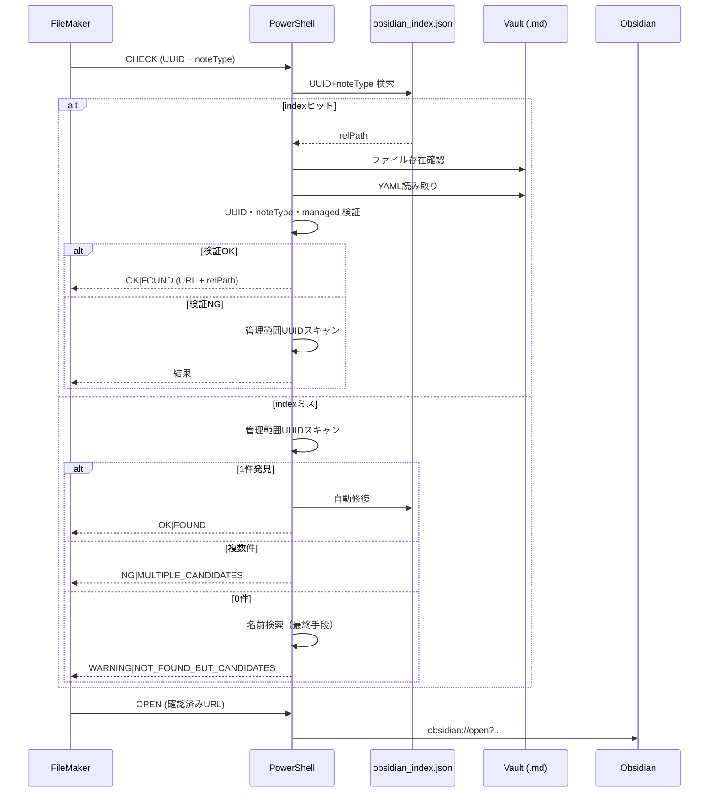
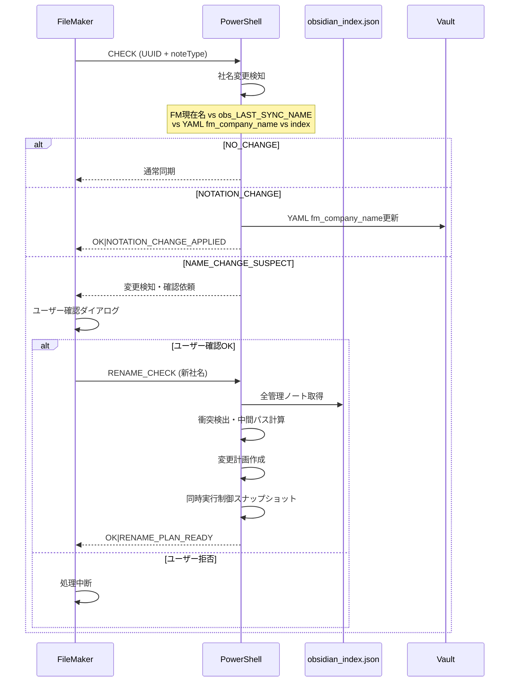
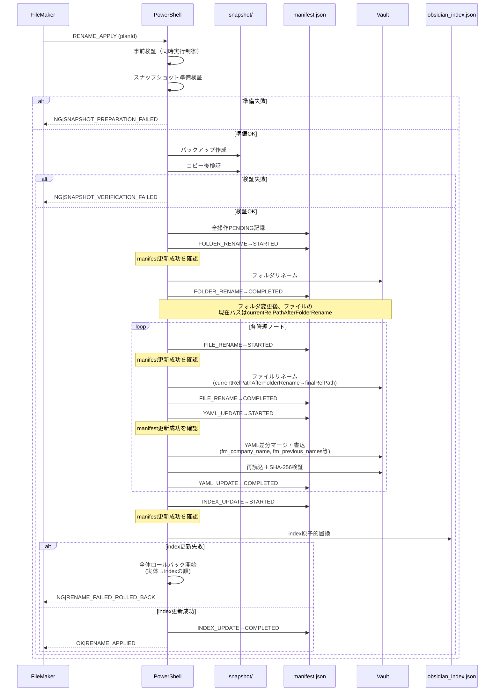
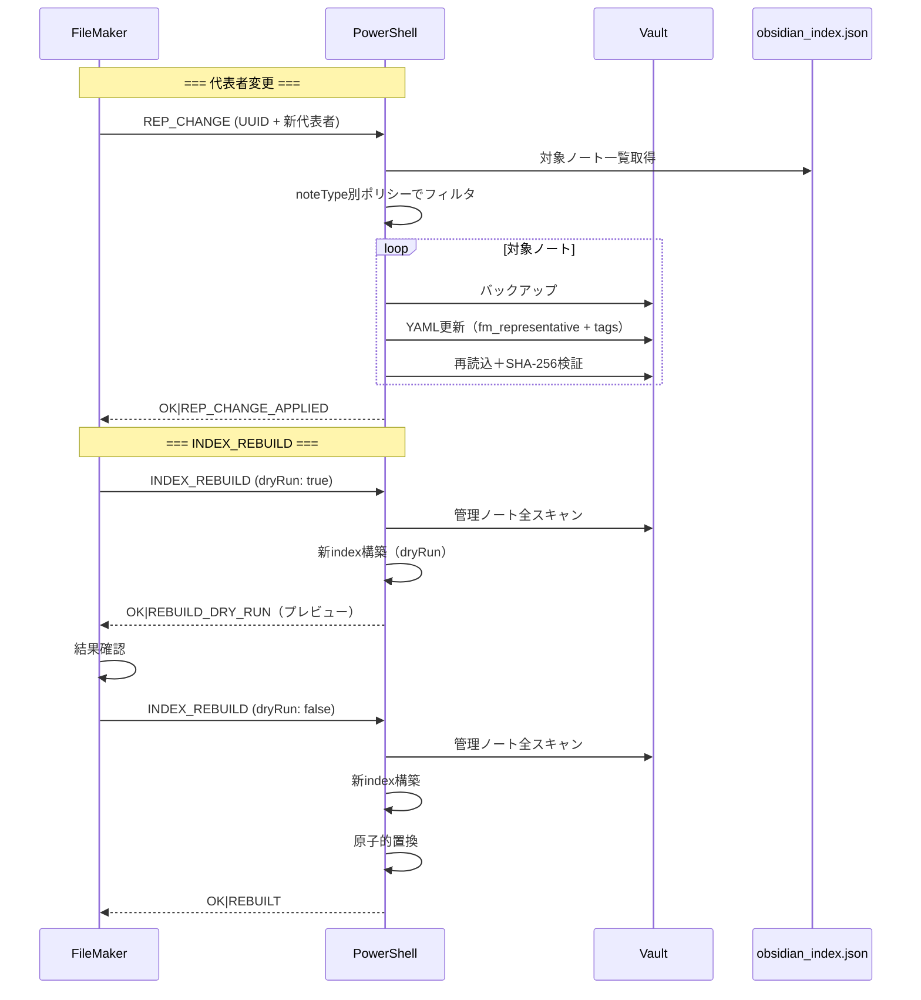
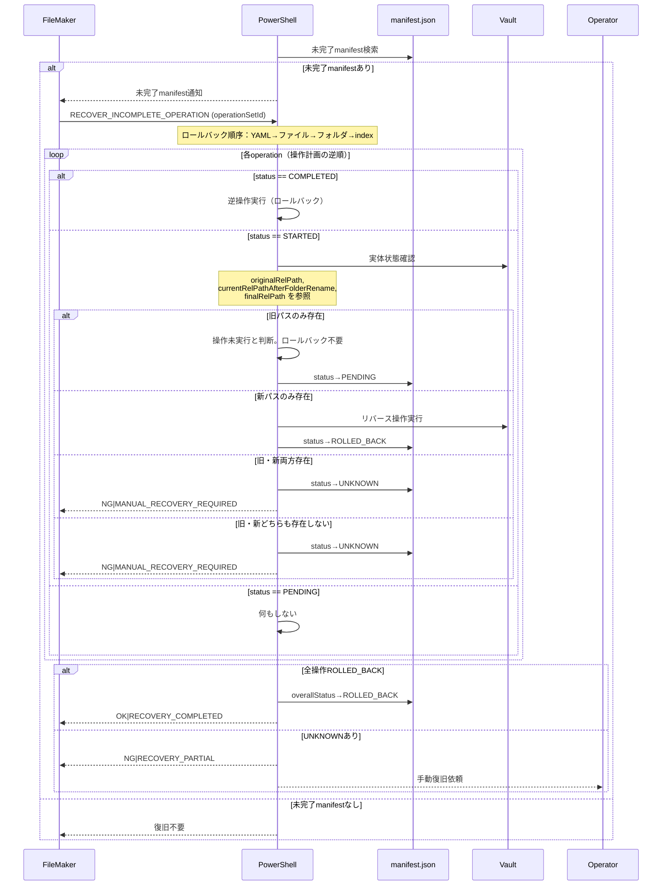
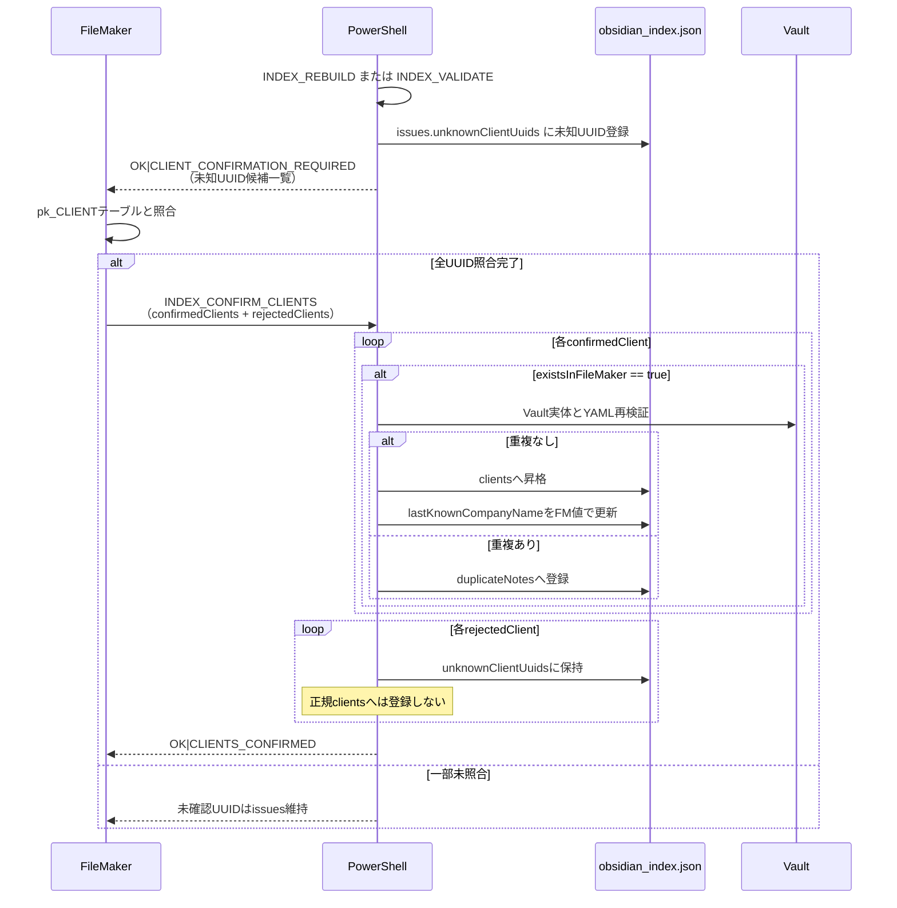
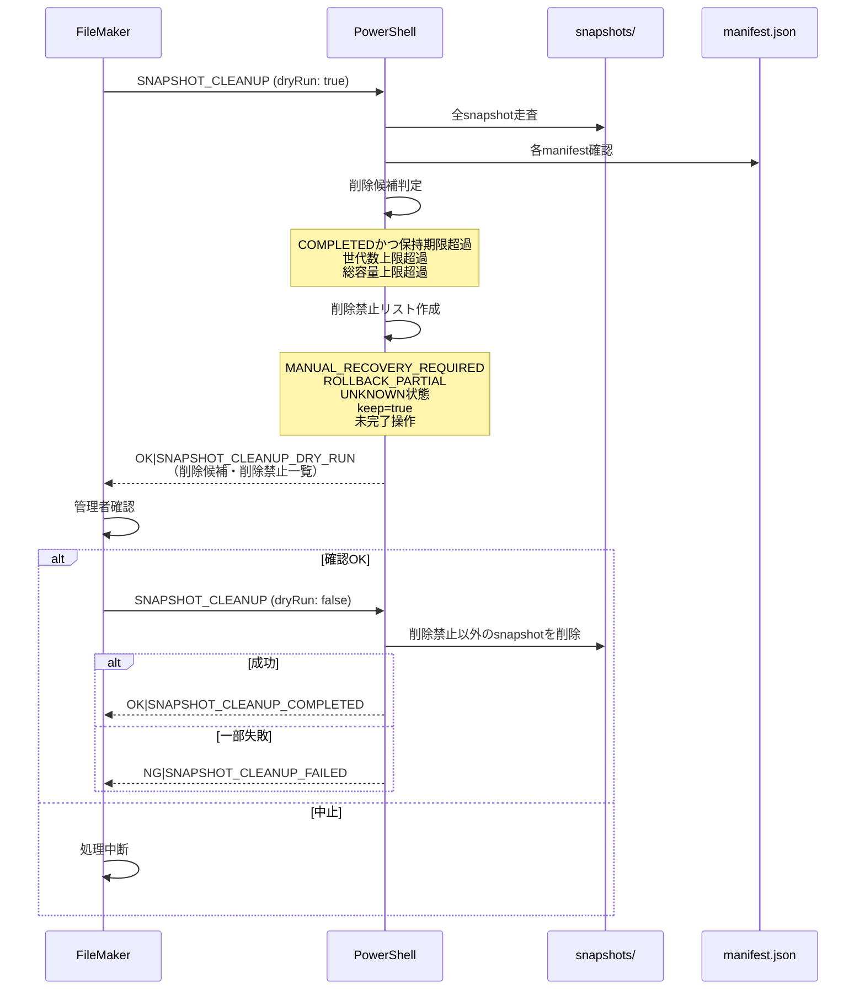

## 第4回修正版へのご指摘 — 受領・全点修正

ご指摘の14件すべてに同意します。特に最重大の3点（ロールバック順序逆転・パス矛盾・`managed_by`無断変更）は、前回「確定」とした仕様からの劣化であり、私のレビュー時の見落としです。以下、全点を修正した**第4回修正版（改訂2）**を提示します。

---

# 第4回修正版からの変更一覧

| No. | 指摘内容 | 修正内容 |
|-----|---------|---------|
| 1 | ロールバック順序が逆転（index→実体） | §16.2：実体(YAML→ファイル→フォルダ)→検証→index の順に修正 |
| 2 | フォルダリネーム後のファイルfromパスが存在しない | §15.2：中間パス（`currentRelPathAfterFolderRename`）を操作計画に追加。Phase 3の実fromを中間パスに変更 |
| 3 | `managed_by`が`filemaker_obsidian_bridge`→`fm_obsidian_bridge`に無断変更 | 全文：`filemaker_obsidian_bridge`に復元 |
| 4 | `fm_company_name`等の`fm_`プレフィックスが回帰 | §5：`fm_company_name`, `fm_representative`, `fm_rank`, `fm_total_premium`, `fm_last_synced_at`, `fm_last_synced_with`に復元。全参照箇所を修正 |
| 5 | 既存状態コードの改名・削除で後方互換性破壊 | §20.3：既存actionコードを全維持。新規コードを追加。protocolVersion=1のまま後方互換 |
| 6 | `INITIAL_SYNC`と`INITIAL_SYNC_APPLIED`の章間揺れ | §12.2, §20.3 他：`OK|INITIAL_SYNC_APPLIED`に統一 |
| 7 | UUID例がRFC 4122形式でない | 全文：UUID例を`550e8400-e29b-41d4-a716-446655440000`形式に統一。§11.3の検証ルールをRFC 4122に修正。§24に`pk_CLIENT`形式の決定事項を追加 |
| 8 | INDEX_REBUILDの管理対象条件が広すぎる | §11.3：走査候補と正式管理対象を分離。`UUIDを持つ`だけではclients登録不可を明記 |
| 9 | YAML_MIGRATEの自動移行条件が危険 | §5.7：`fm_managed==true AND managed_by==filemaker_obsidian_bridge`を必須条件に。UUIDのみでは移行不可 |
| 10 | `fm_previous_names`の更新元がFM履歴とPS追記で混在 | §5.6, §15.2：FM履歴一覧から完全再生成（方式A）に統一。PS独自追記を禁止 |
| 11 | aliasesのユーザー値識別不能性 | §5.6末尾に既知の制約として明記。将来の`fm_materialized_aliases`導入を注記 |
| 12 | 第2章のPhase番号が第22章と不整合 | §2.1：Phase 1〜4, 5, 6〜7の記述を§22と一致させる |
| 13 | `statistics`欠損・破損時の扱い未記載 | §10.2, §11.3：`statistics`欠損時は初期化、破損時は再計算。本体の致命的失敗ではないことを明記 |
| 14 | 最終整合性検査が実際の不整合を無視 | §25末尾：自己検査を不合格に修正。残存不整合なし |

---

# FileMaker ↔ Obsidian 社名・代表者変更対応
# 確定設計書（第4回修正版・改訂2）

---

## 第1章 改訂履歴

| Ver. | 日付 | 改訂内容 | 改訂者 |
|------|------|---------|--------|
| 1.0 | 2026-07-18 | 初版作成（基本設計） | — |
| 2.0 | 2026-07-19 | 第2回修正：UUID検索優先、YAMLメタデータ必須化、noteType内部コード化、issues詳細化、RENAME_APPLY失敗ポリシー、ロールバック順序、同時実行制御 | — |
| 3.0 | 2026-07-20 | 第3回修正：manifest.jsonベースロールバック、tags/aliases分離（fm_tags/fm_previous_names）、INITIAL_SYNC導入、PS責務限定、重複UUID厳密化、unknownClientUuids隔離、index修復失敗時全体ロールバック、SHA-256条件統一、書込後再読込検証、managed_by追加 | — |
| 4.0 | 2026-07-20 | 第4回修正版：tags/aliases差分マージ厳密化、YAMLマージ正規化ルール確定、manifest STARTED状態クラッシュリカバリ、manifest更新失敗時実体操作禁止、snapshot準備失敗時中止条件、UUID正本二概念分離、unknownClientUuids FM照合IF確定、返却プロトコル統一、noteType別同期ポリシー一般化、snapshotクリーンアップ専用責務化、schemaVersion判定分離 | — |
| 4.1 | 2026-07-20 | 第4回修正版・改訂2：ロールバック順序修正（実体→index）、フォルダリネーム後パス矛盾解消（中間パス追加）、managed_by値復元（filemaker_obsidian_bridge）、fm_プレフィックス復元、既存状態コード維持・後方互換確保、INITIAL_SYNC_APPLIED統一、UUID例RFC 4122化、INDEX_REBUILD対象条件厳格化、YAML_MIGRATE自動条件厳格化、fm_previous_names更新元統一（FM正本）、aliases既知制約明記、Phase番号整合、statistics欠損許容明記 | — |

---

## 第2章 総合評価

### 2.1 設計成熟度

**判定：実装着手可能（14件の回帰不具合を修正済）**

| 適用範囲 | 状態 |
|---------|------|
| Phase 1〜4（UUID検索優先・YAMLメタデータ追加・社名変更検知・RENAME_CHECK） | 実装着手可能 |
| Phase 5（RENAME_APPLY、snapshot、manifest、ロールバック。障害系テスト・本番運用前検証） | 本設計の障害系テストを先行実施後に本番適用 |
| Phase 6〜7（INDEX_REBUILD・SNAPSHOT_CLEANUP・YAML_MIGRATE） | 各モードの詳細仕様と運用決定後に実装 |

### 2.2 評価観点別成熟度

| 観点 | 評価 | 備考 |
|------|------|------|
| データ整合性 | ★★★★★ | UUIDを唯一の顧客識別子とし、名前検索への依存を排除。YAMLを永続的割当記録に位置づけ、indexを再構築可能キャッシュに降格。重複UUIDの自動解決禁止、unknownClientUuidsの隔離により、設計上の主要な矛盾を解消した。fm_プレフィックス復元によりユーザーYAMLとの衝突を防止。 |
| 安全性 | ★★★★★ | manifestジャーナルベースのロールバック（実体→indexの安全順）、スナップショット事前検証、実体操作前にmanifest書込成功の必須化、書き込み後再読込＋SHA-256検証により、ユーザー値の意図しない削除リスクを低減する。managed_by値を確定値に復元し管理対象識別の一貫性を確保。 |
| 障害復旧 | ★★★★☆ | STARTED状態からのクラッシュリカバリ判定、UNKNOWN状態の自動操作停止、MANUAL_RECOVERY_REQUIREDの明示により復旧可能性を設計上高めている。ロールバック順序を実体優先に修正。ただし全シナリオの完全自動復旧は実装・運用両面で限界がある。 |
| 保守性 | ★★★★☆ | 責務分離（FM/PowerShell/ユーザー）、YAMLマージの差分分離、noteType別同期ポリシー、schemaVersion管理により長期的保守を支援する。fm_プレフィックスによりシステム所有YAMLの識別が容易。 |
| 拡張性 | ★★★★★ | noteType別ポリシー、protocolVersion、追加モード設計により将来機能追加を想定済み。既存状態コード維持により後方互換を確保。 |
| Obsidian親和性 | ★★★★★ | システムtags/aliases（fm_tags/fm_previous_names）とユーザーtags/aliasesを分離し、Obsidian標準機能を阻害しない。fm_プレフィックスによりシステムフィールドがユーザー領域に混入しない。 |
| 段階移行性 | ★★★★☆ | 7フェーズの段階移行計画により現行運用を停止せず移行可能。混合モード期間の想定あり。Phase番号を§22と整合。 |
| 設計書完成度 | ★★★★☆ | 全25章・全モード・全状態コード・全テストケースを網羅。回帰不具合14件を修正済。一部の運用判断は実装時確定が必要。 |

### 2.3 残存リスク認識

| リスク | 影響 | 対応 |
|--------|------|------|
| 同一秒・同サイズ変更の同時実行制御すり抜け | 競合検出漏れ | 既知の制限として注記。低確率だが発生時は次回同期で検出する設計 |
| Vault大規模時のindex再構築時間 | 一時的パフォーマンス低下 | 段階的スキャン・dry-runによる事前確認で影響範囲を可視化 |
| Obsidian Wikiリンクの自動修復 | リンク切れ残存 | aliasesによる検索補助。完全自動修復は本設計の対象外として明示 |
| ネットワーク同期（iCloud/OneDrive等）との競合 | ファイル競合コピー | 同時実行制御の対象外。Obsidian停止時運用を推奨 |
| ユーザーがシステム値と同一のaliasを意図的に登録した場合の識別不能 | ユーザー値のシステム値誤認 | §5.6末尾に既知の制約として明記。将来の`fm_materialized_aliases`で解決可能 |

---

## 第3章 設計原則

### 3.1 中核原則

1. **UUIDを顧客同一性の唯一のキーとする**
   - ファイル名、フォルダ名、会社名を同一性判定に使用しない
   - UUID値そのものの正本は FileMakerの `pk_CLIENT`
   - このMarkdownがどの顧客に所属すると宣言しているかの永続的割当記録は YAMLの `UUID`
   - index内のUUIDは、YAMLとFileMakerを照合して得られたキャッシュキー

2. **YAMLフロントマターをノート管理メタデータの永続的割当記録とする**
   - ファイルの移動・リネームにかかわらず同一ノートを識別可能にする
   - PowerShellはYAML UUIDをFileMaker値で自動上書きしない
   - UUID不一致は意味的曖昧性として処理を停止し、uuidMismatchNotes issueへ登録する

3. **Markdown本文とユーザーYAMLをユーザー領域とする**
   - システムは本文の自動変更を行わない
   - ユーザーtags、aliases、独自YAMLフィールドを破壊しない
   - システム所有フィールドには`fm_`プレフィックスを付与し、ユーザー領域との衝突を防止する

4. **FileMakerを業務データの正本とする**
   - 会社名、代表者、ランク、保険料等のビジネス情報はFileMakerが正本
   - YAMLは同期されたスナップショットとして保持（`fm_`プレフィックスで識別）

5. **indexを再構築可能なキャッシュとする**
   - `obsidian_index.json` はVaultの全管理ノートから再構築可能
   - 破損・喪失時の再構築手段を提供する
   - キャッシュと実体の不一致は実体（YAML）を優先
   - ロールバック時は実体復旧後にindexを復元または再構築する

6. **manifestをロールバックの操作根拠とする**
   - 各操作の開始・完了・巻戻しをmanifest.jsonにジャーナル記録
   - クラッシュリカバリはmanifestを参照して復旧
   - snapshot + manifestの組み合わせで復旧可能性を高める

7. **managed_byを必須化する**
   - 本ブリッジ以外のシステムが管理するノートの誤操作を防止
   - `managed_by: "filemaker_obsidian_bridge"` で管理対象を識別

### 3.2 安全原則

1. 名前検索をUUID検索より先に実行しない
2. 名前一致だけでノートを確定しない（人間確認を要する）
3. 重複UUIDを日時やサイズで自動解決しない
4. unknownClientUuidsを正規clientsへ自動登録しない
5. 表記変更だけで自動Renameしない（ユーザー確認を要する）
6. RENAME_APPLYの一部成功を正常終了にしない（全体ロールバック）
7. index修復失敗時は全体ロールバックする
8. 代表者変更でMarkdown本文へ自動追記しない
9. CHECK、APPLY、OPENの理想責務を区別する
10. Vault全体のWikiリンクを自動書き換えない
11. ロールバックは実体復旧後にindex復旧（キャッシュを実体より先に戻さない）
12. 既存状態コードを維持し、後方互換を確保する

### 3.3 操作可能性の判定

```text
管理対象候補の識別（以下の全条件で判定）：
  - fm_managed: true
  - managed_by: "filemaker_obsidian_bridge"
  - UUID が存在し、fm_note_type が定義されている

操作可能性の判定（schemaVersionに基づく）：
  fm_schema_version == currentVersion:
    通常操作可能

  fm_schema_version < currentVersion:
    MIGRATION_REQUIRED
    読取・検出は可能
    変更操作は禁止
    YAML_MIGRATE実行後に再検証

  fm_schema_version > currentVersion:
    SCHEMA_VERSION_UNSUPPORTED
    読取以外の操作を禁止
    エラーをFileMakerへ返却
```

---

## 第4章 データ項目の正本・キャッシュ責務

### 4.1 責任一覧表

| データ項目 | 正本 | 同期方向 | 復旧元 |
|-----------|------|---------|--------|
| pk_CLIENT（UUID値そのもの） | FileMaker | — | FileMaker |
| YAML UUID（ノート割当記録） | YAML | 初回書込時にFM→YAML。以降YAMLが保持 | YAML |
| 会社名（業務上正式名称） | FileMaker | FM → YAML（`fm_company_name`）, indexキャッシュ | FileMaker |
| 代表者名 | FileMaker | FM → YAML（`fm_representative`, noteType別ポリシーに従う） | FileMaker |
| ランク | FileMaker | FM → YAML（`fm_rank`, noteType別ポリシーに従う） | FileMaker |
| 総合保険料 | FileMaker | FM → YAML（`fm_total_premium`, noteType別ポリシーに従う） | FileMaker |
| フォルダ名 | Vaultファイルシステム | 表示用ラベル。変更時はRENAME_APPLYで更新 | Vault実体 |
| ファイル名 | Vaultファイルシステム | 表示用ラベル。変更時はRENAME_APPLYで更新 | Vault実体 |
| Markdown本文 | ユーザー | 双方向非同期。システムは変更しない | ユーザーバックアップ |
| ユーザーtags | ユーザー | ユーザーがObsidian上で自由編集 | ユーザー |
| ユーザーaliases | ユーザー | ユーザーがObsidian上で自由編集 | ユーザー |
| fm_tags | FileMaker（間接。会社名・代表者・ランク等から生成） | FM → YAML。差分マージでtagsへ反映 | FileMaker（再生成可能） |
| fm_previous_names | FileMaker（社名変更履歴の完全コピー） | FM → YAML。差分マージでaliasesへ反映。PSが独自追記しない | FileMaker |
| fm_company_name | FileMaker | FM → YAML（同期時更新） | FileMaker |
| fm_representative | FileMaker | FM → YAML（同期時更新、noteType別ポリシーに従う） | FileMaker |
| fm_rank | FileMaker | FM → YAML（同期時更新、noteType別ポリシーに従う） | FileMaker |
| fm_total_premium | FileMaker | FM → YAML（同期時更新、noteType別ポリシーに従う） | FileMaker |
| fm_last_synced_at | システム | FM → YAML（同期時更新） | — |
| fm_last_synced_with | システム | FM → YAML（同期時更新） | — |
| fm_managed | システム（初回作成時書込） | YAML固定値 | YAML |
| managed_by | システム（初回作成時書込） | YAML固定値。値は"filemaker_obsidian_bridge" | YAML |
| fm_schema_version | システム（作成時・移行時更新） | YAML。移行時にシステムが更新 | YAML |
| index内relPath | キャッシュ（Vault実体から構築） | INDEX_REBUILDで再構築 | Vault実体 |
| index内lastKnownCompanyName | キャッシュ（FM同期時更新） | INDEX_REBUILDで再構築 | FileMaker / YAML |
| index内検証タイムスタンプ | キャッシュ | 各操作時に更新 | —（再構築でリセット可） |
| statistics（全般） | 派生キャッシュ | 欠損・破損時は再計算。index本体の有効性に影響しない | 再計算 |

### 4.2 キャッシュ再構築可能性

`obsidian_index.json` は以下の情報源から完全再構築可能：

- Vaultの全管理ノート（`fm_managed: true` AND `managed_by: "filemaker_obsidian_bridge"`）
- 各ノートのYAMLフロントマター
- ファイルシステムのパス情報

再構築手順は §11 INDEX_REBUILD フローを参照。

---

## 第5章 YAMLフロントマタースキーマ

### 5.1 必須フィールド

```yaml
UUID: "550e8400-e29b-41d4-a716-446655440000"
fm_managed: true
managed_by: "filemaker_obsidian_bridge"
fm_note_type: "contract_list"
fm_schema_version: 2
```

### 5.2 システム管理フィールド（`fm_`プレフィックス）

```yaml
fm_company_name: "株式会社ABC商事"
fm_representative: "山田 太郎"
fm_rank: "A"
fm_total_premium: 12345678
fm_tags:
  - "契約一覧"
  - "Aランク"
  - "山田太郎"
fm_previous_names:
  - "ABC商事株式会社"
  - "有限会社ABC"
fm_last_synced_at: "2026-07-20T10:30:00+09:00"
fm_last_synced_with: "pk_CLIENT:550e8400-e29b-41d4-a716-446655440000"
```

### 5.3 ユーザー領域フィールド

```yaml
tags:
  - "要フォロー"
  - "2026年度重点"
aliases:
  - "ABC"
  - "abc-trading"
title: "ABC商事"
```

### 5.4 フィールド編集権限

| フィールド | 編集者 | 備考 |
|-----------|--------|------|
| UUID | システム初回書込 | 以降不変 |
| fm_managed | システム初回書込 | 以降不変 |
| managed_by | システム初回書込 | 値は "filemaker_obsidian_bridge" 固定 |
| fm_note_type | システム初回書込 | 以降不変 |
| fm_schema_version | システム（移行時更新） | YAML_MIGRATE時のみ |
| fm_company_name | システム（同期時更新） | — |
| fm_representative | システム（同期時更新、noteType別ポリシーに従う） | — |
| fm_rank | システム（同期時更新、noteType別ポリシーに従う） | — |
| fm_total_premium | システム（同期時更新、noteType別ポリシーに従う） | — |
| fm_tags | システム（差分マージ前読取、書込） | — |
| fm_previous_names | システム（差分マージ前読取、書込。FM履歴の完全コピー。PS独自追記禁止） | — |
| fm_last_synced_at | システム（同期時更新） | — |
| fm_last_synced_with | システム（同期時更新） | — |
| tags | ユーザー＋システム（差分マージ） | ユーザー値保護 |
| aliases | ユーザー＋システム（差分マージ） | ユーザー値保護 |
| title | ユーザー | システムは変更しない |
| その他独自YAML | ユーザー | システムは変更しない |

### 5.5 tags 差分マージアルゴリズム

```text
【マージ前準備】
previousSystemTags = 更新前YAMLの fm_tags（変更前に読み取る）
newSystemTags      = FileMaker現在値から生成した新しい fm_tags
currentMergedTags  = 更新前YAMLの tags

【ユーザー値の抽出】
userTags =
  currentMergedTags に含まれる各要素のうち、
  previousSystemTags のいずれの要素とも同一と判定されないもの

【最終tagsの生成】
finalTags = unique(userTags + newSystemTags)

【同一判定ルール】
保存値：
  元の表示文字列を保持する。比較のために保存値自体を不可逆変換しない。

重複判定キー（比較用にのみ生成）：
  1. nullを空文字として扱う
  2. 文字列化する
  3. 前後空白をTrimする
  4. Unicode NFCで正規化する
  5. 大文字小文字を区別しない比較を行う（OrdinalIgnoreCase相当）
  6. 空文字になった値は除外する

全角半角変換や法人格除去は、tags/aliasesの重複判定では行わない。
社名変更検知用のNormalize-ForMatchと、YAML配列の重複判定を混同しない。

【書き戻し】
更新後:
  fm_tags = newSystemTags
  tags    = finalTags

【安全原則】
  - 先に更新前のfm_tagsを読み取る。システム値を更新した後に旧システム値を推測しない
  - ユーザー値を削除しない
  - 旧システム値は、新システム値に存在しない場合に正しく除去される
  - 空文字、null、空白のみの値を追加しない
  - 順序は原則としてユーザー値を先、システム値を後に保持する
  - 同一値を重複追加しない
```

### 5.6 aliases 差分マージアルゴリズム

```text
【マージ前準備】
previousSystemAliases = 更新前YAMLの fm_previous_names（変更前に読み取る）
newSystemAliases      = FileMaker正式履歴から同期する新しい fm_previous_names
                        （FileMaker履歴の完全コピー。PowerShellが独自追記しない）
currentMergedAliases  = 更新前YAMLの aliases

【ユーザー値の抽出】
userAliases =
  currentMergedAliases に含まれる各要素のうち、
  previousSystemAliases のいずれの要素とも同一と判定されないもの

【最終aliasesの生成】
finalAliases = unique(userAliases + newSystemAliases)

【同一判定ルール】
tagsと同様のルールを適用：
  - 保存値は原文を保持
  - 比較キーは Trim + Unicode NFC
  - 比較は OrdinalIgnoreCase 相当
  - 全角半角変換や法人格除去は行わない

【書き戻し】
更新後:
  fm_previous_names = newSystemAliases（FM履歴の完全コピー）
  aliases           = finalAliases

【安全原則】
  - 先に更新前のfm_previous_namesを読み取る
  - ユーザー値を削除しない
  - 旧システム値は、新システム値に存在しない場合に正しく除去される
  - 空文字、null、空白のみの値を追加しない
  - 順序は原則としてユーザー値を先、システム値を後に保持する
  - 同一値を重複追加しない

【既知の制約】
  ユーザーがシステム値と同一のaliasを意図的に登録していた場合、
  currentAliases から previousSystemAliases を引く方式では
  ユーザー値として識別できない。
  将来対応として fm_materialized_aliases（前回システムがaliasesへ
  物理反映した値の記録）を導入することで解決可能。
  現時点ではこの制約を認識した上で運用する。
```

### 5.7 既存ノートのYAML移行パス

既存ノートが以下の全条件を満たす場合、YAML_MIGRATEモードで新スキーマへ移行する：

- `fm_managed: true`
- `managed_by` が `"filemaker_obsidian_bridge"`（旧正式値または現正式値）
- `UUID` が存在し、FileMakerの `pk_CLIENT` と一致する
- `fm_note_type` が既知のコードである
- 重複UUID+noteTypeがない

以下のノートは自動移行対象外：

- `managed_by` 不在または他システムの値
- `fm_managed` 不在
- UUID不一致
- 重複UUID+noteType

自動移行対象外のノートは `unmanagedCandidateNotes` または該当issueカテゴリへ登録し、人間確認を経てから移行する。

移行手順：
1. バックアップを作成
2. 不足フィールドをデフォルト値で追加
3. `fm_schema_version` を現行バージョンに更新
4. 書き込み後SHA-256検証
5. 検証失敗時はバックアップから復元

---

## 第6章 ノート種別内部コード

### 6.1 コード一覧

| 内部コード | 表示名 | アイコン | 説明 |
|-----------|--------|---------|------|
| `contract_list` | 契約一覧 | 🟨 | 顧客の全契約を一覧するノート |
| `accident_list` | 事故一覧 | 🟥 | 顧客の事故履歴を一覧するノート |
| `financial_statement` | 決算書 | ◻️ | 顧客の決算書情報ノート |
| `client_summary` | 顧客概要 | 📋 | 顧客の基本情報・概要ノート |
| `meeting_record` | 面談記録 | 📝 | 顧客との面談・打合せ記録 |

### 6.2 noteType別同期ポリシー

```json
{
  "contract_list": {
    "displayName": "契約一覧",
    "syncFields": {
      "companyName": true,
      "representative": true,
      "rank": true,
      "premium": true
    }
  },
  "accident_list": {
    "displayName": "事故一覧",
    "syncFields": {
      "companyName": true,
      "representative": true,
      "rank": false,
      "premium": false
    }
  },
  "financial_statement": {
    "displayName": "決算書",
    "syncFields": {
      "companyName": true,
      "representative": true,
      "rank": false,
      "premium": false
    }
  },
  "client_summary": {
    "displayName": "顧客概要",
    "syncFields": {
      "companyName": true,
      "representative": true,
      "rank": true,
      "premium": true
    }
  },
  "meeting_record": {
    "displayName": "面談記録",
    "syncFields": {
      "companyName": true,
      "representative": false,
      "rank": false,
      "premium": false
    }
  }
}
```

**補足説明**：

- `meeting_record` の `representative` 同期を false としている理由：面談記録は過去時点の記録であり、現在代表者が異なる可能性がある。複数代表者との面談も想定されるため、自動同期が不適切な場合がある。
- 上記の真偽値は設計上の推奨値であり、実装前に人間が確定する。
- 将来のnoteType追加時は、このポリシー設定に新規エントリを追加することで対応する。

### 6.3 コード命名規則

- すべて小文字
- 単語区切りはアンダースコア（`_`）
- FileMaker側では表示名とのマッピングテーブルを保持
- 内部コードは不変（表示名の変更は許容）

---

## 第7章 インデックスJSONスキーマ

### 7.1 スキーマ（schemaVersion: 3）

```json
{
  "schemaVersion": 3,
  "generatedAt": "2026-07-20T10:30:00+09:00",
  "vaultIdentity": {
    "vaultRoot": "C:\\Users\\...\\Documents\\Obsidian\\MyVault",
    "vaultName": "MyVault",
    "machineName": "DESKTOP-ABC123"
  },
  "statistics": {
    "totalClients": 150,
    "managedNotes": 320,
    "issuesTotal": 5,
    "lastFullRebuild": "2026-07-19T08:00:00+09:00",
    "lastValidation": "2026-07-20T10:00:00+09:00"
  },
  "clients": {
    "550e8400-e29b-41d4-a716-446655440000": {
      "lastKnownCompanyNameRaw": "株式会社ABC商事",
      "lastKnownCompanyNameNormalized": "abc商事",
      "folderRelPath": "01_顧客/ABC商事",
      "notes": {
        "contract_list": {
          "relPath": "01_顧客/ABC商事/ABC商事_契約一覧.md",
          "lastVerifiedAt": "2026-07-20T10:30:00+09:00",
          "lastKnownWriteTimeUtc": "2026-07-20T09:00:00Z",
          "lastKnownSize": 4096,
          "lastKnownSha256": "a1b2c3d4e5f600000000000000000000000000000000000000000000000000",
          "yamlUuidMatch": true,
          "yamlNoteTypeMatch": true,
          "schemaVersionOk": true
        },
        "accident_list": {
          "relPath": "01_顧客/ABC商事/ABC商事_事故一覧.md",
          "lastVerifiedAt": "2026-07-20T10:30:00+09:00",
          "lastKnownWriteTimeUtc": "2026-07-20T09:00:00Z",
          "lastKnownSize": 2048,
          "lastKnownSha256": "b2c3d4e5f6a100000000000000000000000000000000000000000000000000",
          "yamlUuidMatch": true,
          "yamlNoteTypeMatch": true,
          "schemaVersionOk": true
        }
      }
    }
  },
  "issues": {
    "duplicateNotes": [
      {
        "uuid": "660e8400-e29b-41d4-a716-446655440001",
        "noteType": "contract_list",
        "conflictingPaths": [
          "01_顧客/DEF商事/DEF商事_契約一覧.md",
          "01_顧客/DEF商事_(旧)/DEF商事_契約一覧.md"
        ],
        "details": [
          {
            "path": "01_顧客/DEF商事/DEF商事_契約一覧.md",
            "size": 4096,
            "sha256": "c3d4e5f6a1b200000000000000000000000000000000000000000000000000",
            "lastWriteTimeUtc": "2026-07-19T10:00:00Z",
            "yamlUuid": "660e8400-e29b-41d4-a716-446655440001",
            "yamlNoteType": "contract_list",
            "fm_managed": true,
            "managed_by": "filemaker_obsidian_bridge"
          }
        ],
        "detectedAt": "2026-07-20T10:00:00+09:00",
        "requiresHumanDecision": true,
        "status": "UNRESOLVED"
      }
    ],
    "unknownClientUuids": [
      {
        "uuid": "770e8400-e29b-41d4-a716-446655440002",
        "foundInNotes": [
          {
            "relPath": "01_顧客/不明顧客/不明顧客_契約一覧.md",
            "yamlCompanyName": "不明商事",
            "fm_note_type": "contract_list"
          }
        ],
        "confirmationStatus": "PENDING_FM_CHECK",
        "detectedAt": "2026-07-20T10:00:00+09:00"
      }
    ],
    "missingUuidNotes": [
      {
        "relPath": "01_顧客/XYZ商事/XYZ商事_契約一覧.md",
        "fm_managed": true,
        "managed_by": "filemaker_obsidian_bridge",
        "reason": "YAMLにUUIDが存在しない",
        "detectedAt": "2026-07-20T10:00:00+09:00"
      }
    ],
    "uuidMismatchNotes": [
      {
        "relPath": "01_顧客/ABC商事/ABC商事_契約一覧.md",
        "indexUuid": "550e8400-e29b-41d4-a716-446655440000",
        "yamlUuid": "880e8400-e29b-41d4-a716-446655440003",
        "requiresHumanDecision": true,
        "detectedAt": "2026-07-20T10:00:00+09:00"
      }
    ],
    "invalidUuidNotes": [
      {
        "relPath": "01_顧客/ABC商事/ABC商事_契約一覧.md",
        "yamlUuid": "invalid-format",
        "reason": "UUID形式不正（RFC 4122形式でない）",
        "detectedAt": "2026-07-20T10:00:00+09:00"
      }
    ],
    "missingNoteTypeNotes": [
      {
        "relPath": "01_顧客/ABC商事/ABC商事_契約一覧.md",
        "fm_managed": true,
        "uuid": "550e8400-e29b-41d4-a716-446655440000",
        "reason": "fm_note_typeが存在しない",
        "detectedAt": "2026-07-20T10:00:00+09:00"
      }
    ],
    "unknownNoteTypeNotes": [
      {
        "relPath": "01_顧客/ABC商事/ABC商事_不明種別.md",
        "uuid": "550e8400-e29b-41d4-a716-446655440000",
        "yamlNoteType": "old_contract_type",
        "reason": "fm_note_typeが既知のコードに該当しない",
        "detectedAt": "2026-07-20T10:00:00+09:00"
      }
    ],
    "invalidYamlNotes": [
      {
        "relPath": "01_顧客/ABC商事/ABC商事_契約一覧.md",
        "reason": "YAML構文エラー",
        "errorDetail": "Unexpected token at line 5",
        "detectedAt": "2026-07-20T10:00:00+09:00"
      }
    ],
    "unmanagedCandidateNotes": [
      {
        "relPath": "01_顧客/ABC商事/メモ.md",
        "reason": "fm_managed:false または managed_by不在だが命名規則に合致",
        "detectedAt": "2026-07-20T10:00:00+09:00"
      }
    ],
    "staleIndexEntries": [
      {
        "uuid": "550e8400-e29b-41d4-a716-446655440000",
        "noteType": "contract_list",
        "indexedRelPath": "01_顧客/ABC商事/ABC商事_契約一覧.md",
        "reason": "ファイルが存在しない",
        "detectedAt": "2026-07-20T10:00:00+09:00"
      }
    ],
    "schemaVersionIssues": [
      {
        "relPath": "01_顧客/ABC商事/ABC商事_契約一覧.md",
        "currentSchemaVersion": 1,
        "requiredSchemaVersion": 2,
        "reason": "MIGRATION_REQUIRED",
        "detectedAt": "2026-07-20T10:00:00+09:00"
      },
      {
        "relPath": "01_顧客/DEF商事/DEF商事_契約一覧.md",
        "currentSchemaVersion": 5,
        "supportedSchemaVersion": 3,
        "reason": "SCHEMA_VERSION_UNSUPPORTED",
        "detectedAt": "2026-07-20T10:00:00+09:00"
      }
    ]
  },
  "orphanEntries": {
    "note": "orphanEntriesはissuesに統合されました。後方互換のため空オブジェクトとして維持。"
  }
}
```

---

## 第8章 イシュー（issues）取扱詳細

### 8.1 イシューカテゴリ一覧

| カテゴリ | 検出条件 | 自動修正可否 | 人間確認要否 | index登録 | ファイル変更 | 削除条件 |
|---------|---------|------------|------------|----------|------------|---------|
| `duplicateNotes` | 同一UUID+noteTypeが複数ファイルに存在 | 不可 | 必須 | 未登録（保留） | なし（保留） | 人間が1ファイルを確定し、重複を解消した後 |
| `unknownClientUuids` | YAML UUIDがFileMakerに存在しない | 不可 | 必須（INDEX_CONFIRM_CLIENTS経由） | 確認後に昇格 | なし | FM確認でexists=false→issues維持。exists=true→clients昇格 |
| `missingUuidNotes` | fm_managed:true かつ managed_by:"filemaker_obsidian_bridge" だがUUID欠如 | 不可 | 推奨 | 未登録 | なし（UUID追加は要確認） | 人間がUUIDを追加後 |
| `uuidMismatchNotes` | indexが指すUUIDとYAML UUIDが不一致 | 不可 | 必須 | 未登録 | なし | 人間が所属を確定後 |
| `invalidUuidNotes` | UUID形式がRFC 4122に違反 | 不可 | 推奨 | 未登録 | なし | UUID修復後 |
| `missingNoteTypeNotes` | fm_note_typeが存在しない | 不可 | 推奨 | 未登録 | なし | noteType確定後 |
| `unknownNoteTypeNotes` | fm_note_typeが定義済みコードにない | 不可 | 推奨 | 未登録 | なし | コード定義追加または修正後 |
| `invalidYamlNotes` | YAML構文エラー | 不可 | 必須 | 未登録 | なし | YAML修復後 |
| `unmanagedCandidateNotes` | 管理外だが命名規則に合致 | 不可 | オプション | 未登録 | なし | 管理対象に追加または確認除外後 |
| `staleIndexEntries` | index登録パスにファイルが存在しない | 可（削除） | 推奨（通知） | エントリ削除 | なし | INDEX_VALIDATE/REBUILD時 |
| `schemaVersionIssues` | schemaVersionが非対応 | 一部可（移行可能な範囲） | 要確認（UNSUPPORTEDの場合） | schemaVersionOk=false | 移行可能ならYAML_MIGRATE | 移行完了または確認後 |

### 8.2 検証・再構築のスコープ制限

以下のノートのみを検証・再構築の対象とする：

1. **管理対象ノート**：`fm_managed: true` AND `managed_by: "filemaker_obsidian_bridge"` を満たすノート
2. **管理候補ノート**：UUIDを持ち、既知のfm_note_typeコードを持つが、管理フラグが不足しているノート（確認後に管理対象へ昇格）。自動ではclients登録しない。
3. **既にindex登録済みのノート**：現行indexにエントリが存在するノート（staleかどうかの検証対象）

以下のノートは検証・再構築の対象外：

- `fm_managed` が存在しない、または `false` のノート
- `managed_by` が `"filemaker_obsidian_bridge"` 以外のノート（他システム管理）
- テンプレート、デイリーノート、システムノート等の非顧客ノート
- スキャン範囲外のフォルダに存在するノート

### 8.3 unknownClientUuidsのFileMaker照合インターフェース

#### 照合フロー

```text
Step 1: INDEX_VALIDATE / INDEX_REBUILDが未知UUID候補一覧をpayloadでFileMakerへ返す
  状態コード: OK|CLIENT_CONFIRMATION_REQUIRED|{payloadBase64}

Step 2: FileMakerがpk_CLIENTテーブルと照合する

Step 3: FileMakerが確認結果をINDEX_CONFIRM_CLIENTSモードでPowerShellへ返す
```

#### INDEX_CONFIRM_CLIENTS 入力JSON

```json
{
  "protocolVersion": 1,
  "requestId": "550e8400-e29b-41d4-a716-446655440099",
  "timestamp": "2026-07-20T10:30:00+09:00",
  "mode": "INDEX_CONFIRM_CLIENTS",
  "data": {
    "confirmedClients": [
      {
        "uuid": "550e8400-e29b-41d4-a716-446655440000",
        "existsInFileMaker": true,
        "currentCompanyName": "株式会社ABC商事"
      }
    ],
    "rejectedClients": [
      {
        "uuid": "770e8400-e29b-41d4-a716-446655440002",
        "existsInFileMaker": false
      }
    ]
  }
}
```

#### 処理

```text
existsInFileMaker == true:
  - 再度Vault実体とYAMLを検証
  - 重複がない場合のみclientsへ昇格
  - indexのlastKnownCompanyNameをFM値で更新

existsInFileMaker == false:
  - unknownClientUuidsに保持
  - 正規clientsへ登録しない

確認結果に含まれないUUID:
  - 未確認のまま保持（再度確認依頼が必要）
```

#### 状態コード

```text
OK|CLIENT_CONFIRMATION_REQUIRED|{payloadBase64}
OK|CLIENTS_CONFIRMED|{payloadBase64}
NG|CLIENT_CONFIRMATION_INVALID|{payloadBase64}
```

---

## 第9章 検索・自己修復フロー

### 9.1 検索優先順位

```text
第1優先：index上のUUID検索
  1. indexのclients.{pk_CLIENT}.notes.{fm_note_type} を参照
  2. エントリが存在する場合、relPathの実ファイル存在を確認
  3. 実ファイルのYAMLを読み取り、UUID、fm_note_type、fm_managed を検証
  4. 検証OK → 発見。検証NG → 第2優先へ

第2優先：管理対象スコープ内のUUID検索
  1. 全管理対象ノート（fm_managed:true, managed_by:"filemaker_obsidian_bridge"）を全スキャン
  2. YAML UUIDが pk_CLIENT と一致し、fm_note_type が一致するノートを検索
  3. 1件 → 自動修復（index更新）
  4. 複数件 → duplicateNotes へ登録し、人間確認を要求
  5. 0件 → 第3優先へ

第3優先（最終手段）：名前検索
  1. 会社名正規化後のフォルダ名・ファイル名検索
  2. 複数候補をFileMakerへ返却
  3. 自動確定は行わない
  4. 人間が候補から選択する

禁止事項：
  - 名前検索をUUID検索より先に実行しない
  - 名前一致だけでノートを自動確定しない
  - 重複UUIDを日時やサイズで自動解決しない
```

### 9.2 UUID不一致（uuidMismatchNotes）の扱い

```text
indexが指すUUIDとYAMLのUUIDが不一致の場合：
  - 処理を停止する
  - uuidMismatchNotes issueへ登録する
  - PowerShellはYAML UUIDをFileMaker値で自動上書きしない
  - FileMaker上の対象顧客、YAML現在値、ファイルパスを人間へ提示する
  - 人間がノートの正しい所属顧客を確定した後にのみ修正する
```

### 9.3 検索結果の返却形式

```json
{
  "protocolVersion": 1,
  "requestId": "550e8400-e29b-41d4-a716-446655440099",
  "timestamp": "2026-07-20T10:30:00+09:00",
  "mode": "CHECK",
  "data": {
    "searchResult": "FOUND",
    "matchedNotes": [
      {
        "relPath": "01_顧客/ABC商事/ABC商事_契約一覧.md",
        "noteType": "contract_list",
        "url": "obsidian://open?vault=MyVault&file=01_顧客%2FABC商事%2FABC商事_契約一覧",
        "yamlUuidMatch": true,
        "yamlNoteTypeMatch": true,
        "schemaVersionOk": true
      }
    ]
  },
  "warnings": [],
  "errors": []
}
```

---

## 第10章 INDEX_VALIDATE フロー

### 10.1 目的

既存indexの整合性を検証し、自動修復可能な不整合を修正する。

### 10.2 処理手順

```text
1. index.jsonを読み込む
2. schemaVersionを確認
3. statisticsが欠損している場合は初期化。破損している場合は再計算。
   statisticsの更新失敗や欠損はindex本体の致命的失敗ではない。
4. statisticsを更新（lastValidation）。更新失敗時は警告を記録し継続。
5. clientsセクションを走査：
   a. 各クライアントのnotesエントリについて：
      - 実ファイルの存在確認
      - YAML読み取り
      - UUID一致確認
      - fm_note_type一致確認
      - schemaVersion確認
      - 最終書込時刻・サイズ・SHA-256を更新
   b. 不一致・不在をissuesへ分類
6. issuesセクションを更新：
   - 新規issueを追加
   - 解消済みissueを除去
7. statistics.issuesTotalを更新
8. 安全にindex.jsonを書き換え（tmp→検証→置換）
9. 結果サマリーをFileMakerへ返却
```

### 10.3 自動修復対象

| 状態 | 自動修復 | 条件 |
|------|---------|------|
| indexエントリが指すファイルが存在しない | staleIndexEntriesに登録後、エントリ削除 | 通知を伴う |
| 管理対象ノートがindexに未登録 | 新規エントリ追加 | YAML検証パス後。管理対象条件厳守 |
| 最終書込時刻・サイズの更新 | 更新 | 常時 |
| UUID不一致（index vs YAML） | 不可 | uuidMismatchNotesへ登録 |
| 重複UUID+noteType | 不可 | duplicateNotesへ登録 |
| 未知UUID | 不可 | unknownClientUuidsへ登録 |
| schemaVersion不一致（移行可能） | 不可 | schemaVersionIssuesへ登録 |

### 10.4 返却形式

```json
{
  "protocolVersion": 1,
  "requestId": "550e8400-e29b-41d4-a716-446655440099",
  "timestamp": "2026-07-20T10:30:00+09:00",
  "mode": "INDEX_VALIDATE",
  "data": {
    "validationResult": "OK",
    "statistics": {
      "totalClients": 150,
      "managedNotes": 320,
      "issuesTotal": 5,
      "autoFixed": 2,
      "requiresHumanDecision": 3
    },
    "issuesSummary": {
      "duplicateNotes": 1,
      "unknownClientUuids": 2,
      "missingUuidNotes": 0,
      "uuidMismatchNotes": 0,
      "invalidUuidNotes": 0,
      "missingNoteTypeNotes": 0,
      "unknownNoteTypeNotes": 0,
      "invalidYamlNotes": 0,
      "unmanagedCandidateNotes": 0,
      "staleIndexEntries": 2,
      "schemaVersionIssues": 0
    }
  },
  "warnings": [],
  "errors": []
}
```

---

## 第11章 INDEX_REBUILD フロー

### 11.1 目的

index.jsonをVaultの全管理ノートから完全再構築する。

### 11.2 前提

- index.jsonは再構築可能なキャッシュである
- 再構築により既存のキャッシュ情報（lastKnownWriteTime等）はリセットされる
- 既存のissuesは再スキャンにより再評価される
- statisticsが欠損・破損している場合は新規計算される。index本体の有効性には影響しない。

### 11.3 処理手順

```text
1. 既存index.jsonをバックアップ（.bak）
2. 走査対象の収集：
   a. スキャン範囲：管理対象フォルダ（デフォルトは01_顧客/以下）
   b. 走査対象（広く収集）：
      - 管理対象フォルダ内の全Markdownファイル
      - 各ファイルからYAMLを抽出試行
      - UUID、fm_note_type、fm_managed、managed_by、fm_company_name を収集
   c. 走査対象は広く取るが、clients登録は厳格に判定する
3. 正式管理対象の判定（以下の全条件を満たすもののみclients候補）：
   - fm_managed: true
   - managed_by: "filemaker_obsidian_bridge"
   - UUID有効（RFC 4122形式）
   - fm_note_type有効（既知の内部コード）
4. 非管理対象の分類：
   - UUIDがありfm_note_typeがあるがmanaged_by不在 → unmanagedCandidateNotes
   - managed_byが別システム値 → 管理対象外（無視）
   - fm_managed:false → 管理対象外（無視）
   - UUIDがない → missingUuidNotes（ただしfm_managed:trueかつmanaged_by正しい場合のみ）
5. UUID+noteTypeでグループ化
6. 重複検出：
   - 同一UUID+noteTypeが複数ファイル → duplicateNotesへ
   - 自動解決は禁止。人間確認必須
   - 比較データ（パス、サイズ、SHA-256、最終書込時刻）を提供
7. UUID検証：
   - 形式チェック（RFC 4122: 8-4-4-4-12 の36文字）
   - 未知UUID → unknownClientUuidsへ。clientsへは登録しない
8. NoteType検証：
   - 既知の内部コードか確認
   - 未知コード → unknownNoteTypeNotesへ
9. 新規indexを構築：
   - 重複・未知・不正のない正式管理対象ノートのみclientsへ
   - 全issueをissuesセクションへ
   - statisticsを計算（欠損時は新規計算）
10. dryRunモードの場合：
   - 再構築結果のプレビューをFileMakerへ返却
   - index.jsonは更新しない
11. 本番実行の場合：
   - 新規indexをtmpファイルに書き出し
   - tmpファイルのJSONとしての正当性を検証
   - tmpファイルをindex.jsonへ原子的に置換
   - 旧indexは.bakとして保持
12. 結果をFileMakerへ返却
```

### 11.4 禁止事項

```text
- 重複UUIDを日時・サイズで自動解決しない
- UUIDのない一般ノートを無条件で問題扱いしない
- 名前一致だけで自動的にクライアントを特定しない
- 不正なYAMLを自動修正しない（人間確認必須）
- unknownClientUuidsを確認なしでclientsに昇格しない
- managed_by不在・別値を正式管理対象としない
- UUIDのみで正式管理対象と判定しない
```

### 11.5 返却形式

```text
dryRunモード：
  OK|INDEX_REBUILD_DRY_RUN|{payloadBase64}

本番モード：
  OK|INDEX_REBUILD_COMPLETED|{payloadBase64}
  NG|INDEX_REBUILD_FAILED|{payloadBase64}
```

---

## 第12章 社名変更検知

### 12.1 検知の優先順位

```text
1. FileMakerの現在の会社名（正本）
2. FileMakerの obs_LAST_SYNC_NAME（前回同期時の社名）
3. YAMLの fm_company_name（最終同期時の社名スナップショット）
4. indexの lastKnownCompanyNameRaw（キャッシュ参照）
```

### 12.2 検知マトリックス

| obs_LAST_SYNC_NAME | FileMaker現在社名 | 正規化比較 | 分類 | アクション |
|-------------------|------------------|-----------|------|-----------|
| null / 空 | 任意 | — | INITIAL_SYNC | 通常同期。変更検知なし |
| ABC商事株式会社 | ABC商事株式会社 | raw同一, norm同一 | NO_CHANGE | 通常同期 |
| ABC商事株式会社 | ㈱ABC商事 | raw差異, norm同一 | NOTATION_CHANGE | §13 表記変更フロー |
| ABC商事株式会社 | DEFホールディングス株式会社 | raw差異, norm差異 | NAME_CHANGE_SUSPECT | §14 RENAME_CHECKフロー |

### 12.3 正規化ルール（Normalize-ForMatch）

```text
1. 全角英数字 → 半角
2. 全角カタカナ → 半角カタカナ
3. 法人格の正規化：
   株式会社 ↔ ㈱ ↔ (株) → すべて "kabushikigaisha" 相当に統一
   有限会社 ↔ (有) → 統一
   合同会社 ↔ (同) → 統一
4. 空白・タブ・改行を除去
5. Unicode NFCで正規化
6. 大文字小文字を区別しない
```

この正規化は社名変更検知専用であり、tags/aliasesの重複判定とは異なる処理である。

### 12.4 注意点

- `INITIAL_SYNC`（初回同期）は空値誤判定防止のため特別扱い
- 社名変更ダイアログはNAME_CHANGE_SUSPECT時のみ表示
- 表記変更は自動的にYAML更新を行うが、RENAMEはユーザー確認を要する

---

## 第13章 表記変更（NOTATION_CHANGE）フロー

### 13.1 定義

```text
表記変更：法人格の表記揺れ、全角半角違いなど、実質的に同一会社だが
          表示上の表記が変更されたケース。

例：
  - 株式会社ABC商事 → ㈱ABC商事
  - ＡＢＣ商事株式会社 → ABC商事株式会社（全角→半角）
```

### 13.2 フロー

```text
1. 社名変更検知で NOTATION_CHANGE と判定
2. 自動処理：
   a. 該当クライアントの全管理ノートについて：
      - YAML fm_company_name をFileMakerの新しい表記で更新
      - tags/aliases を差分マージにより更新（§5.5, §5.6）
      - fm_tags を新しい表記に基づき再生成
      - 新しい表記を fm_previous_names に追加するかは、
        FileMaker履歴を正本とし、PSが独自判断しない
   b. indexの lastKnownCompanyNameRaw を更新
3. フォルダ名・ファイル名の変更：
   - 自動では実行しない
   - FileMaker上でユーザーに確認ダイアログを表示
   - ユーザーが希望する場合のみ RENAME_CHECK を経て RENAME_APPLY を実行
4. 同期完了ステータス：
   OK|NOTATION_CHANGE_APPLIED|{payloadBase64}
```

### 13.3 YAML更新

表記変更時のYAML更新は、tags/aliasesの差分マージアルゴリズム（§5.5, §5.6）に従う。

```text
【更新前YAML例】
fm_company_name: "株式会社ABC商事"
fm_tags: ["契約一覧", "Aランク", "山田太郎"]
fm_previous_names: ["ABC商事株式会社"]
tags: ["要フォロー", "契約一覧", "Aランク", "山田太郎"]
aliases: ["ABC", "ABC商事株式会社"]

【FileMaker新表記】
"㈱ABC商事"

【更新後YAML】
fm_company_name: "㈱ABC商事"
fm_tags: ["契約一覧", "Aランク", "山田太郎"]  ← fm_company_nameを含まないため変更なし
fm_previous_names: ["ABC商事株式会社"]  ← FileMaker履歴の完全コピー。PS独自追記しない
tags: ["要フォロー", "契約一覧", "Aランク", "山田太郎"]  ← 差分マージでユーザー値保持
aliases: ["ABC", "ABC商事株式会社"]  ← 差分マージでユーザー値保持
```

---

## 第14章 RENAME_CHECK フロー

### 14.1 目的

社名変更（NAME_CHANGE_SUSPECT）が検出された場合、変更計画を作成し、衝突検出と事前検証を行う。

### 14.2 入力

```json
{
  "protocolVersion": 1,
  "requestId": "550e8400-e29b-41d4-a716-446655440099",
  "timestamp": "2026-07-20T10:30:00+09:00",
  "mode": "RENAME_CHECK",
  "data": {
    "uuid": "550e8400-e29b-41d4-a716-446655440000",
    "newCompanyName": "DEFホールディングス株式会社",
    "normalizedNewName": "defholdingskabushikigaisha",
    "changeType": "NAME_CHANGE_SUSPECT"
  }
}
```

### 14.3 処理手順

```text
1. 入力検証（UUIDの実在確認、新社名の非空確認）
2. indexから該当UUIDの全管理ノートを取得
3. 新フォルダ名候補を生成し、存在確認
4. 以下を検出：
   - 同名フォルダの既存（別UUID）：NAME_CLASH
   - 同名フォルダの既存（同一UUID）：ALREADY_RENAMED
   - ノートの同時編集：CONCURRENT_MODIFICATION
5. 変更計画（RenamePlan）を作成。
   操作定義にはoriginalRelPath（旧パス）、currentRelPathAfterFolderRename（フォルダリネーム後の中間パス）、finalRelPath（ファイル名変更後の最終パス）を含める。
6. 結果をFileMakerへ返却：
   OK|RENAME_PLAN_READY|{payloadBase64}
   または
   NG|RENAME_CONFLICT|{payloadBase64}
```

### 14.4 返却payloadの構造

```json
{
  "protocolVersion": 1,
  "requestId": "550e8400-e29b-41d4-a716-446655440099",
  "timestamp": "2026-07-20T10:30:00+09:00",
  "mode": "RENAME_CHECK",
  "data": {
    "planId": "PLAN-20260720-001",
    "uuid": "550e8400-e29b-41d4-a716-446655440000",
    "oldCompanyName": "ABC商事株式会社",
    "newCompanyName": "DEFホールディングス株式会社",
    "operations": [
      {
        "operationId": 1,
        "type": "FOLDER_RENAME",
        "from": "01_顧客/ABC商事",
        "to": "01_顧客/DEFホールディングス"
      },
      {
        "operationId": 2,
        "type": "FILE_RENAME",
        "originalRelPath": "01_顧客/ABC商事/ABC商事_契約一覧.md",
        "currentRelPathAfterFolderRename": "01_顧客/DEFホールディングス/ABC商事_契約一覧.md",
        "finalRelPath": "01_顧客/DEFホールディングス/DEFホールディングス_契約一覧.md"
      },
      {
        "operationId": 3,
        "type": "YAML_UPDATE",
        "targetFile": "01_顧客/DEFホールディングス/DEFホールディングス_契約一覧.md",
        "updates": {
          "fm_company_name": "DEFホールディングス株式会社",
          "fm_previous_names": "(FileMaker履歴から完全コピー)"
        }
      },
      {
        "operationId": 4,
        "type": "INDEX_UPDATE",
        "updates": {
          "folderRelPath": "01_顧客/DEFホールディングス",
          "lastKnownCompanyNameRaw": "DEFホールディングス株式会社",
          "notes.*.relPath": "(各noteのパスを更新)"
        }
      }
    ],
    "conflicts": [],
    "estimatedBackupSizeBytes": 122880,
    "requiresUserConfirmation": true,
    "riskLevel": "LOW"
  },
  "warnings": [],
  "errors": []
}
```

---

## 第15章 RENAME_APPLY フロー

### 15.1 前提条件

```text
- RENAME_CHECKが正常完了し、RENAME_PLAN_READYが返却されている
- ユーザーがFileMaker上で実行を確認している
- 単一障害点ポリシー：いずれかの必須変更が失敗した場合、操作全体を中止しロールバックする
- 一部成功（PARTIAL_SUCCESS）は正常終了として扱わない
```

### 15.2 実行フェーズ

```text
Phase 0: 事前検証
  1. RENAME_CHECKで生成されたplanIdの有効性を確認
  2. 同時実行制御：全対象ファイルの現在のLastWriteTimeUtc, Size, SHA-256を再取得
  3. RENAME_CHECK時点の値と比較
  4. 不一致がある場合：
     → NG|RENAME_CONCURRENT_MODIFICATION|{payloadBase64}
     → 操作中止
  5. スナップショットディレクトリの準備：
     a. .obsidian_bridge/snapshots が存在する、または作成可能か
     b. 今回のsnapshotディレクトリを作成できるか
     c. snapshotディレクトリへテストファイルを書込み・読取り・削除できるか
     d. バックアップ対象の総サイズを算出できるか
     e. 必要空き容量を満たすか
  6. いずれかが失敗：
     → NG|SNAPSHOT_PREPARATION_FAILED|{payloadBase64}
     → フォルダ名変更、ファイル名変更、YAML変更、index変更を一切開始しない
     → 作成途中のsnapshotディレクトリを可能な範囲で削除する
     → 削除失敗時は残存パスを警告へ含める

Phase 1: バックアップ作成
  1. 全対象ファイルとindex.jsonをsnapshotディレクトリへコピー
  2. コピー後のサイズまたはSHA-256が元ファイルと一致することを検証
  3. 検証失敗：
     → NG|SNAPSHOT_VERIFICATION_FAILED|{payloadBase64}
     → 後続操作を一切開始しない
  4. manifest.jsonを作成し、全操作をPENDINGとして記録
  5. manifestを検証

Phase 2: フォルダリネーム
  1. manifestのFOLDER_RENAMEエントリをSTARTEDに更新
  2. manifest更新成功を確認（失敗時はNG|MANIFEST_WRITE_FAILED）
  3. フォルダのリネームを実行
  4. 成功検証（新フォルダの存在確認）
  5. manifestのFOLDER_RENAMEエントリをCOMPLETEDに更新
  6. COMPLETED更新失敗時は実体確認による状態判定を実施

Phase 3: ファイルリネーム
  注意：フォルダリネーム後、ファイルの現在パスは currentRelPathAfterFolderRename に変化している。
  各管理ノートについて：
  1. manifestのFILE_RENAMEエントリをSTARTEDに更新
  2. manifest更新成功を確認（失敗時はNG|MANIFEST_WRITE_FAILED）
  3. 実fromパスとして currentRelPathAfterFolderRename を使用し、
     finalRelPath へファイルリネームを実行
  4. 成功検証（新ファイルの存在確認、ハッシュ検証）
  5. manifestのFILE_RENAMEエントリをCOMPLETEDに更新

Phase 4: YAML更新
  各管理ノートについて：
  1. manifestのYAML_UPDATEエントリをSTARTEDに更新
  2. manifest更新成功を確認
  3. YAML読み取り
  4. 差分マージ（§5.5, §5.6）：
     - fm_company_nameを新社名に更新
     - fm_previous_namesをFileMaker履歴の完全コピーで上書き（PS独自追記禁止）
     - tags/aliasesを差分マージ
     - fm_last_synced_atを更新
  5. YAML書き込み
  6. 書き込み後再読込＋SHA-256検証
  7. manifestのYAML_UPDATEエントリをCOMPLETEDに更新

Phase 5: index更新
  1. manifestのINDEX_UPDATEエントリをSTARTEDに更新
  2. manifest更新成功を確認
  3. index内の該当クライアントエントリを更新：
     - folderRelPath
     - lastKnownCompanyNameRaw/Normalized
     - 全notesのrelPath
  4. indexの原子的置換（tmp→検証→置換）
  5. index修復失敗時は全体ロールバック対象

Phase 6: 完了
  1. manifest全体の完了フラグを設定
  2. snapshotに完了マークを付与
  3. FileMakerへ成功を返却：
     OK|RENAME_APPLIED|{payloadBase64}
```

### 15.3 状態コード

```text
OK|RENAME_PLAN_READY|{payloadBase64}
OK|RENAME_APPLIED|{payloadBase64}
NG|RENAME_CONFLICT|{payloadBase64}
NG|RENAME_CONCURRENT_MODIFICATION|{payloadBase64}
NG|RENAME_FAILED_ROLLED_BACK|{payloadBase64}
NG|RENAME_FAILED_ROLLBACK_PARTIAL|{payloadBase64}
NG|MANUAL_RECOVERY_REQUIRED|{payloadBase64}
NG|SNAPSHOT_PREPARATION_FAILED|{payloadBase64}
NG|SNAPSHOT_VERIFICATION_FAILED|{payloadBase64}
NG|MANIFEST_WRITE_FAILED|{payloadBase64}
NG|MANIFEST_STATE_UNCERTAIN|{payloadBase64}
```

---

## 第16章 補償・ロールバック

### 16.1 manifestジャーナル構造

```json
{
  "manifestVersion": 1,
  "operationSetId": "RENAME-20260720-001",
  "operationType": "COMPANY_RENAME",
  "overallStatus": "IN_PROGRESS",
  "createdAt": "2026-07-20T10:30:00+09:00",
  "updatedAt": "2026-07-20T10:30:15+09:00",
  "snapshotDir": ".obsidian_bridge/snapshots/20260720_103000_550e8400",
  "targetUuid": "550e8400-e29b-41d4-a716-446655440000",
  "operations": [
    {
      "operationId": 1,
      "operationType": "FOLDER_RENAME",
      "fromRelPath": "01_顧客/ABC商事",
      "toRelPath": "01_顧客/DEFホールディングス",
      "backupRelPath": ".obsidian_bridge/snapshots/20260720_103000_550e8400/folder_01_顧客_ABC商事",
      "beforeSha256": null,
      "expectedAfterSha256": null,
      "status": "STARTED",
      "startedAt": "2026-07-20T10:30:01+09:00",
      "completedAt": null,
      "rolledBackAt": null,
      "lastError": null
    },
    {
      "operationId": 2,
      "operationType": "FILE_RENAME",
      "originalRelPath": "01_顧客/ABC商事/ABC商事_契約一覧.md",
      "currentRelPathAfterFolderRename": "01_顧客/DEFホールディングス/ABC商事_契約一覧.md",
      "finalRelPath": "01_顧客/DEFホールディングス/DEFホールディングス_契約一覧.md",
      "backupRelPath": ".obsidian_bridge/snapshots/20260720_103000_550e8400/ABC商事_契約一覧.md",
      "beforeSha256": "a1b2c3d4e5f600000000000000000000000000000000000000000000000000",
      "expectedAfterSha256": "a1b2c3d4e5f600000000000000000000000000000000000000000000000000",
      "status": "PENDING",
      "startedAt": null,
      "completedAt": null,
      "rolledBackAt": null,
      "lastError": null
    },
    {
      "operationId": 3,
      "operationType": "YAML_UPDATE",
      "targetFile": "01_顧客/DEFホールディングス/DEFホールディングス_契約一覧.md",
      "backupRelPath": ".obsidian_bridge/snapshots/20260720_103000_550e8400/ABC商事_契約一覧.md",
      "beforeSha256": "a1b2c3d4e5f600000000000000000000000000000000000000000000000000",
      "expectedAfterSha256": null,
      "status": "PENDING",
      "startedAt": null,
      "completedAt": null,
      "rolledBackAt": null,
      "lastError": null
    },
    {
      "operationId": 4,
      "operationType": "INDEX_UPDATE",
      "backupRelPath": ".obsidian_bridge/snapshots/20260720_103000_550e8400/obsidian_index.json",
      "beforeSha256": "i1j2k3l4m5n600000000000000000000000000000000000000000000000000",
      "expectedAfterSha256": null,
      "status": "PENDING",
      "startedAt": null,
      "completedAt": null,
      "rolledBackAt": null,
      "lastError": null
    }
  ]
}
```

### 16.2 ロールバック順序

indexは再構築可能なキャッシュであり、実体より先に戻してはならない。途中でロールバックが失敗した場合、indexだけ旧状態・実体は新旧混在となることを防止する。

```text
正式順序：

1. YAML／Markdown内容復元
   - バックアップから各管理ノートのYAML+Markdownを復元
   - 復元後のSHA-256をバックアップ時と照合
   - 1ファイルでも検証失敗 → 継続して残りを復元し、最終的にMANUAL_RECOVERY_REQUIRED

2. ファイル名復元
   - 操作計画の逆順で各ファイルをリバースリネーム
   - 各リネーム後に存在確認

3. フォルダ名復元
   - 操作計画の逆順でフォルダをリバースリネーム
   - リネーム後に存在確認

4. 実体全体検証
   - 全ファイルの存在確認
   - 各ファイルのSHA-256がバックアップ時と一致することを確認
   - 1件でも不一致 → MANUAL_RECOVERY_REQUIRED

5. index復元または再構築
   - バックアップされたindex.jsonを復元
   - またはINDEX_REBUILDを実行して実体と整合した新indexを生成

6. indexと実体の最終照合
   - indexの全エントリのrelPathが実体と一致することを確認
   - 不一致がある場合はINDEX_VALIDATEで修復
```

### 16.3 manifest STARTED状態のクラッシュリカバリ

PowerShell起動時またはRENAME_APPLY開始前に、未完了manifest（`overallStatus != COMPLETED` かつ `overallStatus != ROLLED_BACK`）を検出した場合、新規変更を開始せずRECOVER_INCOMPLETE_OPERATIONモードで復旧処理を行う。

#### 操作状態の定義

```text
PENDING:          操作未開始
STARTED:          操作開始済み（manifest記録成功、実体操作の成否は未確定）
COMPLETED:        操作完了（manifestにCOMPLETED記録あり）
ROLLED_BACK:      ロールバック完了
ROLLBACK_FAILED:  ロールバック失敗
UNKNOWN:          状態不明（実体の存在状態から判断不能）
```

#### 復旧判定ロジック

##### FILE_RENAME の復旧判定

```text
originalRelPathが存在し、finalRelPathが存在しない：
  → 操作は未実行と判断
  → ロールバック操作不要
  → エントリをPENDINGに戻す

originalRelPathが存在せず、finalRelPathが存在する：
  → 操作済みと判断
  → finalRelPathをoriginalRelPathへ戻す（リバースリネーム）
  → 成功後、エントリをROLLED_BACKに更新

originalRelPathもfinalRelPathも存在する：
  → 状態不明・競合
  → UNKNOWN
  → 自動ロールバックを停止
  → MANUAL_RECOVERY_REQUIRED

originalRelPathもfinalRelPathも存在しない：
  → 状態不明
  → UNKNOWN
  → MANUAL_RECOVERY_REQUIRED

注意：
  フォルダリネームが先行している場合、途中状態では
  currentRelPathAfterFolderRename と finalRelPath の比較になる。
  復旧判定は操作計画の全パス（originalRelPath,
  currentRelPathAfterFolderRename, finalRelPath）を参照して総合判断する。
```

##### FOLDER_RENAME の復旧判定

```text
旧フォルダが存在し、新フォルダが存在しない：
  → 操作未実行
  → ロールバック操作不要

旧フォルダが存在せず、新フォルダが存在する：
  → 操作済み
  → 新フォルダを旧フォルダ名へリネーム
  → 成功後、エントリをROLLED_BACKに更新

新旧両方存在：
  → 競合
  → UNKNOWN
  → MANUAL_RECOVERY_REQUIRED

新旧どちらも存在しない：
  → 状態不明
  → UNKNOWN
  → MANUAL_RECOVERY_REQUIRED
```

##### YAML_UPDATE の復旧判定

```text
現在ファイルのSHA-256 == beforeSha256：
  → 更新未実行と判断

現在ファイルのSHA-256 == expectedAfterSha256：
  → 更新済みと判断し、バックアップから復元
  → 復元後SHA-256検証

どちらにも一致しない：
  → 第三者変更または途中書込
  → UNKNOWN
  → MANUAL_RECOVERY_REQUIRED
```

##### INDEX_UPDATE の復旧判定

```text
現在indexのSHA-256 == beforeSha256：
  → 更新未実行

現在indexのSHA-256 == expectedAfterSha256：
  → 更新済みと判断し、バックアップから復元

どちらにも一致しない：
  → UNKNOWN
  → ただしindexは再構築可能キャッシュのため、実体復旧後に
    INDEX_REBUILDで再構築する選択肢もある
  → MANUAL_RECOVERY_REQUIRED
```

### 16.4 RECOVER_INCOMPLETE_OPERATION モード

```text
入力：
  operationSetId（省略時は全未完了manifestを対象）

処理：
  1. 未完了manifestを検索
  2. 各manifestの全operationをstatus降順で処理：
     a. status == COMPLETED: ロールバック対象（逆操作実行）
     b. status == STARTED: 実体状態を確認し、§16.3の判定に従う
     c. status == PENDING: 操作未開始のため何もしない
     d. status == ROLLED_BACK: 既にロールバック済み
     e. status == ROLLBACK_FAILED: 前回失敗。手動復旧が必要
     f. status == UNKNOWN: 手動復旧が必要
  3. 全ての操作のロールバック完了後、manifestのoverallStatusをROLLED_BACKに更新
  4. 一部でもUNKNOWN/ROLLBACK_FAILEDが残る場合、MANUAL_RECOVERY_REQUIRED

ロールバック順序（manifest上の操作順序の逆順）：
  1. 実体（YAML→ファイル→フォルダ）を復旧
  2. 実体全体を検証
  3. indexを復旧または再構築
  4. 最終照合

状態コード：
  OK|RECOVERY_COMPLETED|{payloadBase64}
  NG|RECOVERY_PARTIAL|{payloadBase64}
  NG|MANUAL_RECOVERY_REQUIRED|{payloadBase64}
```

### 16.5 スナップショットクリーンアップ

#### 専用モード：SNAPSHOT_CLEANUP

```text
入力：
  {
    "protocolVersion": 1,
    "requestId": "550e8400-e29b-41d4-a716-446655440099",
    "timestamp": "2026-07-20T10:30:00+09:00",
    "mode": "SNAPSHOT_CLEANUP",
    "data": {
      "retentionDays": 30,
      "maxGenerations": 20,
      "maxTotalBytes": 10737418240,
      "dryRun": true
    }
  }

削除対象判定：
  - COMPLETED かつ保持期限超過
  - RENAME_FAILED_ROLLED_BACK かつ保持期限超過
  - 世代数上限を超過（古いものから）
  - 総容量上限を超過（古いものから）

削除禁止：
  - MANUAL_RECOVERY_REQUIRED
  - RENAME_FAILED_ROLLBACK_PARTIAL
  - manifestが不正
  - 未完了操作（overallStatusがIN_PROGRESSまたはSTARTEDのみでCOMPLETED/ROLLED_BACKなし）
  - UNKNOWN状態を含むsnapshot
  - 管理者がkeep=trueを指定したsnapshot

実行方式：
  - dry-runを必須サポート
  - dry-run結果をFileMakerで確認後に本番実行可能
  - OSタスクスケジューラ等から自動実行する場合も、削除禁止条件を厳守

状態コード：
  OK|SNAPSHOT_CLEANUP_DRY_RUN|{payloadBase64}
  OK|SNAPSHOT_CLEANUP_COMPLETED|{payloadBase64}
  NG|SNAPSHOT_CLEANUP_FAILED|{payloadBase64}
```

#### 実行契機

```text
- INDEX_VALIDATE実行時には暗黙的に実行しない（責務分離）
- 手動実行：FileMakerからの明示的トリガー
- 定期実行：OSタスクスケジューラ等（別途設定）
- 実行前に必ずdry-runを実施し、結果を確認する
```

---

## 第17章 代表者変更（REP_CHANGE）フロー

### 17.1 定義

代表者変更はFileMaker上の`representative`フィールド変更を検出し、管理ノートのYAMLのみを更新する。フォルダ名・ファイル名の変更は行わない。

### 17.2 フロー

```text
1. 代表者変更の検出
   - FileMakerの現在の代表者値を取得
   - ノートのYAML fm_representativeと比較
   - または、obs_LAST_SYNC_REPと比較

2. 対象ノートの特定
   - indexから該当UUIDの全管理ノートを取得
   - noteType別同期ポリシーで syncFields.representative == true のノートのみ対象
   - meeting_record 等、representative同期がfalseのノートは対象外

3. YAML更新（各対象ノート）：
   a. バックアップを作成
   b. 同時実行制御（LastWriteTimeUtc, Size, SHA-256）
   c. YAMLの fm_representative フィールドを更新
   d. 差分マージにより tags/aliases を更新（§5.5, §5.6）
   e. 代表者のタグ（例："山田太郎"）を新しい代表者に置換
   f. fm_last_synced_at を更新
   g. 書き込み後再読込＋SHA-256検証

4. 代表者履歴の扱い
   - FileMakerを公式履歴の正本とする
   - YAMLに履歴配列は持たない
   - Markdown本文への自動追記は行わない
   - 過去代表者はfm_previous_names相当の履歴には追加しない（代表者はaliases対象外）

5. index更新：
   - 特になし（representativeはindexキャッシュ対象外）

6. 返却：
   OK|REP_CHANGE_APPLIED|{payloadBase64}
```

### 17.3 対象外ノート

```text
noteType別同期ポリシーで syncFields.representative == false のノート：
  - meeting_record（過去時点の面談記録として現在代表者への自動同期が不適切な可能性があるため）
```

---

## 第18章 モード責務一覧

### 18.1 モード状態表

| モード | 目的 | 読取対象 | 書込対象 | index更新 | FM確認 | 冪等性 | 失敗時 |
|--------|------|---------|---------|----------|--------|--------|--------|
| CHECK | ノート検索・存在確認 | YAML, index, Vault | なし | なし | 不要（候補提示） | 読取のみのため冪等 | 候補なしを返却 |
| OPEN | Obsidianでノートを開く | index | なし | なし | 不要 | 冪等 | URL不正を返却 |
| APPLY | 既存ノートのYAML更新 | YAML, index | YAML, index | あり | 不要（事前CHECK済） | 条件付き（同時実行制御により保護） | ロールバック |
| COMPARE | CSV照合 | Vault, CSV | 差分ファイル | なし | 不要 | 冪等（結果は上書き） | エラーファイル出力 |
| RENAME_CHECK | 社名変更の事前検証 | YAML, index, Vault | なし | なし | 必須 | 読取のみのため冪等 | コンフリクト返却 |
| RENAME_APPLY | 社名変更の実行 | YAML, index, Vault | Vault, YAML, index | あり | 必須（事前） | 不可（状態変化） | ロールバック（実体→index） |
| INDEX_VALIDATE | index整合性検証 | index, YAML, Vault | index（修復時） | あり | 一部（重複・未知UUID） | 可 | エラーレポート |
| INDEX_REBUILD | index完全再構築 | Vault, YAML | index（新規） | 全書換 | 一部（未知UUID確認） | 可（上書き） | 旧index保持 |
| INDEX_CONFIRM_CLIENTS | 未知UUIDのFM確認結果反映 | index, FM確認結果 | index | あり | 確認結果を入力 | 可 | エラー返却 |
| REP_CHANGE | 代表者変更のYAML反映 | YAML, index, FM | YAML | 限定的 | 不要 | 条件付き | ロールバック（実体→index） |
| YAML_MIGRATE | 旧schemaVersionノートの移行 | YAML | YAML | あり | 不要（自動判定） | 不可（状態変化） | ロールバック（実体→index） |
| RECOVER_INCOMPLETE_OPERATION | クラッシュリカバリ | manifest, Vault | Vault, manifest | あり | 不要（自動） | 不可（状態変化） | MANUAL_RECOVERY_REQUIRED |
| SNAPSHOT_CLEANUP | 古いスナップショットの削除 | snapshot, manifest | snapshot（削除） | なし | dry-run確認推奨 | 可 | エラーレポート |

### 18.2 CHECK / APPLY / OPEN の責務分離

| モード | 理想責務 | 現行実装 | 推奨移行 |
|--------|---------|---------|---------|
| CHECK | 読取専用。検証と計画作成のみ | 一部APPLY的動作を含む | Phase 1で純粋なCHECKに分離 |
| APPLY | 書込・更新・index更新 | CHECK的動作を含む | Phase 2で純粋なAPPLYに分離 |
| OPEN | 確認済みノートをObsidianで開く | 隠れた書込なし | 現行維持。ただしAPPLY後はCHECKせずOPENを使用 |

---

## 第19章 楽観的同時実行制御

### 19.1 方針

```text
- ロックファイルによる排他制御は採用しない（Obsidianとの競合を避けるため）
- 楽観的同時実行制御を採用
- RENAME_CHECK時点でのファイル状態を記録
- RENAME_APPLY開始前に現在状態を再確認
- 変更があれば競合として処理を中止
```

### 19.2 比較項目

| ノート種別 | 比較項目 | 備考 |
|-----------|---------|------|
| 全管理ノート | LastWriteTimeUtc + Size + SHA-256 | 全件SHA-256。同一秒・同サイズ変更のエッジケースは低確率だが、既知の制限として注記 |
| index.json | SHA-256 | 全件SHA-256 |

### 19.3 制御フロー

```text
1. RENAME_CHECK時：
   - 全対象ファイルの LastWriteTimeUtc, Size, SHA-256 を取得
   - 変更計画に添付

2. RENAME_APPLY開始直前：
   - 全対象ファイルの現在の LastWriteTimeUtc, Size, SHA-256 を再取得
   - RENAME_CHECK時の値と比較
   - 全て一致 → 続行
   - いずれか不一致 → NG|RENAME_CONCURRENT_MODIFICATION を返却し中止
   - ユーザーに再CHECKを促す

3. 各ファイル書き込み後：
   - 再読込し、SHA-256を検証
   - 不一致時は当該操作を失敗とし、ロールバックを開始
```

### 19.4 既知の制限

```text
- 同一秒・同サイズでの変更は検出できない（SHA-256比較により検出確率は極めて高いが理論上完全ではない）
- 外部同期ツール（iCloud, OneDrive等）による非同期変更とは競合する可能性がある
- 推奨：RENAME_APPLY実行中はObsidianを終了し、同期ツールの一時停止を推奨
```

---

## 第20章 FileMaker返却状態コード

### 20.1 統一返却形式

すべてのモードで以下の形式に統一する：

```text
{status}|{action}|{payloadBase64}
```

| 要素 | 説明 | 制約 |
|------|------|------|
| status | OK / WARNING / NG | 3値のいずれか |
| action | 固定内部コード | 英数字・アンダースコア。既存actionコードを維持 |
| payloadBase64 | UTF-8 JSONをBase64エンコード | デコード可能な有効なBase64 |

**必須ルール**：

```text
- 可変文字列（社名、パス、理由文）はすべてpayload JSONへ格納
- rawの社名、パス、理由文をパイプ区切りの個別項目として返さない
- payloadはUTF-8 JSONをBase64化
- Base64デコード失敗やJSON不正はプロトコルエラーとして扱う
- protocolVersion: 1 のまま後方互換を維持する
- 既存のactionコードは削除・改名しない
```

### 20.2 共通payloadスキーマ

```json
{
  "protocolVersion": 1,
  "requestId": "550e8400-e29b-41d4-a716-446655440099",
  "timestamp": "ISO-8601",
  "mode": "RENAME_APPLY",
  "data": {},
  "warnings": [],
  "errors": []
}
```

### 20.3 状態コード一覧（既存維持＋新規追加）

#### 正常系

```text
【既存維持】
OK|FOUND|{payloadBase64}
OK|CREATED|{payloadBase64}
OK|OPENED|{payloadBase64}
OK|NOT_FOUND|{payloadBase64}
OK|NEED_FOLDER_CONFIRM|{payloadBase64}
OK|VALIDATED|{payloadBase64}
OK|REBUILT|{payloadBase64}
OK|REBUILD_DRY_RUN|{payloadBase64}
OK|INITIAL_SYNC_APPLIED|{payloadBase64}

【新規追加】
OK|NOTATION_CHANGE_APPLIED|{payloadBase64}
OK|REP_CHANGE_APPLIED|{payloadBase64}
OK|RENAME_PLAN_READY|{payloadBase64}
OK|RENAME_APPLIED|{payloadBase64}
OK|CLIENT_CONFIRMATION_REQUIRED|{payloadBase64}
OK|CLIENTS_CONFIRMED|{payloadBase64}
OK|INDEX_VALIDATE_COMPLETED|{payloadBase64}
OK|INDEX_REBUILD_COMPLETED|{payloadBase64}
OK|YAML_MIGRATION_PLAN_READY|{payloadBase64}
OK|YAML_MIGRATED|{payloadBase64}
OK|RECOVERY_COMPLETED|{payloadBase64}
OK|SNAPSHOT_CLEANUP_DRY_RUN|{payloadBase64}
OK|SNAPSHOT_CLEANUP_COMPLETED|{payloadBase64}
```

#### 警告系

```text
【既存維持】
WARNING|INDEX_STALE|{payloadBase64}
WARNING|YAML_REPAIRED|{payloadBase64}

【新規追加】
WARNING|NOT_FOUND_BUT_CANDIDATES|{payloadBase64}
WARNING|STALE_INDEX_DETECTED|{payloadBase64}
WARNING|UNMANAGED_CANDIDATE_DETECTED|{payloadBase64}
```

#### エラー系

```text
【既存維持】
NG|FILE_NOT_FOUND|{payloadBase64}
NG|UUID_MISMATCH|{payloadBase64}
NG|DUPLICATE_UUID|{payloadBase64}
NG|NEED_CONFIRM|{payloadBase64}
NG|INTERNAL_ERROR|{payloadBase64}
NG|INVALID_INPUT|{payloadBase64}

【新規追加】
NG|NOT_FOUND|{payloadBase64}
NG|MULTIPLE_CANDIDATES|{payloadBase64}
NG|RENAME_CONFLICT|{payloadBase64}
NG|RENAME_CONCURRENT_MODIFICATION|{payloadBase64}
NG|RENAME_FAILED_ROLLED_BACK|{payloadBase64}
NG|RENAME_FAILED_ROLLBACK_PARTIAL|{payloadBase64}
NG|MANUAL_RECOVERY_REQUIRED|{payloadBase64}
NG|SNAPSHOT_PREPARATION_FAILED|{payloadBase64}
NG|SNAPSHOT_VERIFICATION_FAILED|{payloadBase64}
NG|MANIFEST_WRITE_FAILED|{payloadBase64}
NG|MANIFEST_STATE_UNCERTAIN|{payloadBase64}
NG|INDEX_REBUILD_FAILED|{payloadBase64}
NG|INDEX_VALIDATE_FAILED|{payloadBase64}
NG|YAML_MIGRATION_FAILED|{payloadBase64}
NG|SCHEMA_VERSION_UNSUPPORTED|{payloadBase64}
NG|CLIENT_CONFIRMATION_INVALID|{payloadBase64}
NG|PROTOCOL_DECODE_FAILED|{payloadBase64}
NG|PROTOCOL_VERSION_UNSUPPORTED|{payloadBase64}
NG|REQUEST_ID_MISMATCH|{payloadBase64}
NG|SNAPSHOT_CLEANUP_FAILED|{payloadBase64}
NG|RECOVERY_PARTIAL|{payloadBase64}
```

---

## 第21章 Mermaidシーケンス図

### M-1: 通常OPENシーケンス



### M-2: 社名変更検知・RENAME_CHECKシーケンス



### M-3: RENAME_APPLYシーケンス



### M-4: 代表者変更・INDEX_REBUILDシーケンス



### M-5: manifest STARTED状態からのクラッシュリカバリ



### M-6: unknownClientUuids確認フロー



### M-7: スナップショットクリーンアップ



---

## 第22章 移行計画

### 22.1 移行Phase

| Phase | 内容 | 影響範囲 | 新旧共存 | 移行期間目安 |
|-------|------|---------|---------|------------|
| Phase 1 | UUID検索優先ロジック導入。CHECKモードでUUID→名前の検索順を適用。 | PSブリッジ | ○ | 1〜2日 |
| Phase 2 | 新規ノート作成時にYAML必須フィールド（fm_managed, managed_by:"filemaker_obsidian_bridge", fm_note_type, fm_schema_version）を自動追加。 | PSブリッジ | ○（既存ノートは旧形式のまま） | 1日 |
| Phase 3 | 既存ノートへのYAMLメタデータ追加マイグレーション（YAML_MIGRATEモード）。 | Vaultの全管理対象ノート | ○（未移行ノートも並存） | 1〜3日（検証含む） |
| Phase 4 | 社名変更検知・RENAME_CHECK導入。NOTATION_CHANGEとNAME_CHANGE_SUSPECTの検出。 | PSブリッジ + FM | ○（変更検知が強化されるのみ） | 2〜3日 |
| Phase 5 | RENAME_APPLY導入。社名変更の実実行。manifestベースのロールバック（実体→index順）。中間パス対応。 | PSブリッジ + FM + Vault | ○（既存は従来通りOPENで運用可） | 3〜5日（テスト重点） |
| Phase 6 | INDEX_REBUILD / INDEX_VALIDATE / INDEX_CONFIRM_CLIENTS の全機能導入。SNAPSHOT_CLEANUP導入。 | PSブリッジ + FM | ○ | 2〜3日 |
| Phase 7 | 運用監視・微調整。スナップショットクリーンアップの定期実行設定。 | 全体 | — | 1〜2週間（監視期間） |

### 22.2 段階的移行の原則

```text
- 各Phaseで後方互換性を維持する
- 新旧ノートの混合モードを許容する
- 新規作成ノートは自動的に新形式で作成
- 既存ノートはアクセス時に段階的に移行（またはYAML_MIGRATEで一括移行）
- 各Phase完了後に動作確認を実施
- 問題発生時は該当Phaseのみロールバック可能
- managed_byの固定値は Phase 2 から "filemaker_obsidian_bridge" を使用
```

### 22.3 現行運用への影響最小化

```text
- Phase 1〜2は内部ロジック変更のみで、FileMaker側の改修は最小限
- Phase 3はオプション。移行しなくてもPhase 1〜2の機能は動作
- Phase 4〜6は新機能追加であり、既存機能を変更しない
- 全Phaseを通じて、Obsidian Vaultのユーザーデータを破壊する操作は存在しない
- 既存状態コードは全Phaseで維持され、FileMaker側の分岐ロジックを破壊しない
```

---

## 第23章 テスト計画

### 23.1 単体テスト

#### 一般機能

| ID | テスト項目 | 期待結果 |
|----|----------|---------|
| UT-01 | 会社名正規化（Normalize-ForMatch） | ㈱ABC商事 → abc商事 |
| UT-02 | UUID形式検証（RFC 4122） | `550e8400-e29b-41d4-a716-446655440000`形式のみ通過 |
| UT-03 | Base64エンコード・デコード | 日本語・特殊文字を含むJSONが正しく往復 |
| UT-04 | YAMLパース（正常系） | 全フィールド正しく抽出 |
| UT-05 | YAMLパース（破損YAML） | エラー検出、invalidYamlNotes登録 |
| UT-06 | YAMLパース（ユーザー独自フィールド） | システムフィールドと分離して保持 |
| UT-07 | tags差分マージ（旧fm_tagsに存在し新fm_tagsに存在しないタグの除去） | 最終tagsから正しく除去される |
| UT-08 | tags差分マージ（ユーザー独自タグの保持） | ユーザー値が削除されない |
| UT-09 | tags差分マージ（ユーザー値とシステム値が同一の場合の重複防止） | 重複しない |
| UT-10 | tags差分マージ（Unicode NFC差異） | 同一と判定される |
| UT-11 | tags差分マージ（大文字小文字差異） | 同一と判定される |
| UT-12 | tags差分マージ（前後空白） | 正規化後同一と判定 |
| UT-13 | tags差分マージ（空文字/null） | 追加されない |
| UT-14 | tags差分マージ（法人格表記差） | 自動統合されない（別値として扱う） |
| UT-15 | aliases差分マージ（旧fm_previous_namesに存在し新に存在しない値の除去） | 最終aliasesから正しく除去 |
| UT-16 | aliases差分マージ（ユーザー独自aliasの保持） | ユーザー値が削除されない |
| UT-17 | noteType別同期ポリシー（representative同期） | meeting_recordはfm_representative更新対象外 |
| UT-18 | noteType別同期ポリシー（rank同期） | contract_listはfm_rank更新対象 |
| UT-19 | schemaVersion判定（現行バージョン） | 操作可能 |
| UT-20 | schemaVersion判定（旧バージョン） | MIGRATION_REQUIRED、変更操作禁止 |
| UT-21 | schemaVersion判定（将来バージョン） | SCHEMA_VERSION_UNSUPPORTED、読取以外禁止 |
| UT-22 | UUID不一致検出 | uuidMismatchNotes登録、自動上書きしない |
| UT-23 | 保存値と比較キーの分離 | 保存値は原文保持、比較はTrim+NFC+IgnoreCase |
| UT-24 | managed_by値検証 | "filemaker_obsidian_bridge"のみ管理対象。他値は対象外 |
| UT-25 | fm_previous_names = FileMaker履歴完全コピー | PS独自追記なし。FM履歴と一致 |
| UT-26 | ロールバック順序検証 | 実体(YAML→ファイル→フォルダ)→検証→indexの順 |
| UT-27 | フォルダリネーム後中間パス計算 | currentRelPathAfterFolderRenameが操作計画通り |
| UT-28 | UUID RFC 4122形式検証（8-4-4-4-12） | 正規表現で36文字の形式のみ許容 |
| UT-29 | statistics欠損時初期化 | index読込正常。statisticsが新規計算される |
| UT-30 | statistics破損時再計算 | index読込正常。破損値が再計算される |
| UT-31 | statistics更新失敗時継続 | 警告を記録し、index本体操作は継続 |
| UT-32 | YAML_MIGRATE対象条件（managed_by不在拒否） | 移行不可。unmanagedCandidateNotes登録 |
| UT-33 | YAML_MIGRATE対象条件（全条件充足） | 移行成功。fm_schema_version更新 |
| UT-34 | INDEX_REBUILD走査対象 vs clients登録の分離 | UUIDのみではclients登録されない |

#### manifestクラッシュリカバリ

| ID | テスト項目 | 期待結果 |
|----|----------|---------|
| UT-35 | STARTED後、操作前に停止 | 操作未実行と判定、PENDINGに戻す |
| UT-36 | 実体操作成功後、COMPLETED前に停止（FILE_RENAME） | 新パス→旧パスにリバース（中間パス考慮） |
| UT-37 | 旧パスのみ存在 | 操作未実行と判定 |
| UT-38 | 新パスのみ存在 | 操作済みと判定、リバース実行 |
| UT-39 | 旧・新両方存在 | UNKNOWN、MANUAL_RECOVERY_REQUIRED |
| UT-40 | 旧・新どちらも存在しない | UNKNOWN、MANUAL_RECOVERY_REQUIRED |
| UT-41 | manifest更新失敗 | NG|MANIFEST_WRITE_FAILED、実体操作未実行 |
| UT-42 | manifest JSON破損 | 不正manifestとして検出、MANUAL_RECOVERY_REQUIRED |
| UT-43 | manifest tmpファイル残存 | 検出し、適切に処理 |
| UT-44 | フォルダリネーム後中間パスでの復旧判定 | currentRelPathAfterFolderRename正しく評価 |

#### スナップショット準備

| ID | テスト項目 | 期待結果 |
|----|----------|---------|
| UT-45 | ディレクトリ作成失敗 | NG|SNAPSHOT_PREPARATION_FAILED、実体無変更 |
| UT-46 | 書込権限なし | NG|SNAPSHOT_PREPARATION_FAILED、実体無変更 |
| UT-47 | 空き容量不足 | NG|SNAPSHOT_PREPARATION_FAILED、実体無変更 |
| UT-48 | コピー途中失敗 | NG|SNAPSHOT_VERIFICATION_FAILED、実体無変更 |
| UT-49 | コピー後ハッシュ不一致 | NG|SNAPSHOT_VERIFICATION_FAILED、実体無変更 |
| UT-50 | manifest作成失敗 | NG|MANIFEST_WRITE_FAILED、実体無変更 |
| UT-51 | スナップショット準備失敗後に実体が無変更であること | 全ファイル・フォルダが変更前と同一 |

#### FileMaker照合

| ID | テスト項目 | 期待結果 |
|----|----------|---------|
| UT-52 | confirmedClientsへ昇格 | clientsへ登録、lastKnownCompanyName更新 |
| UT-53 | rejectedClientsはissues維持 | unknownClientUuidsに残留 |
| UT-54 | 同一UUIDの重複候補 | duplicateNotesへ登録 |
| UT-55 | 不正payload | NG|CLIENT_CONFIRMATION_INVALID |
| UT-56 | requestId不一致 | NG|REQUEST_ID_MISMATCH |
| UT-57 | protocolVersion不一致 | NG|PROTOCOL_VERSION_UNSUPPORTED |

#### プロトコル

| ID | テスト項目 | 期待結果 |
|----|----------|---------|
| UT-58 | パイプを含む社名 | payload JSON内で正しく保持 |
| UT-59 | 改行を含むエラー文 | payload JSON内で正しく保持 |
| UT-60 | 日本語・絵文字を含むパス | payload JSON内で正しく保持 |
| UT-61 | Base64不正 | NG|PROTOCOL_DECODE_FAILED |
| UT-62 | JSON不正 | NG|PROTOCOL_DECODE_FAILED |
| UT-63 | 未知action | プロトコルエラーとして扱う |
| UT-64 | status|action|payloadBase64 のパース | 全区切り文字が正しく処理される |
| UT-65 | 空payload | 適切に処理（null dataとして扱う） |
| UT-66 | 既存actionコード維持確認 | OK|FOUND, OK|VALIDATED, NG|FILE_NOT_FOUND等が使用可能 |

#### YAML移行

| ID | テスト項目 | 期待結果 |
|----|----------|---------|
| UT-67 | YAML_MIGRATE正常系 | 不足フィールド追加、schemaVersion更新 |
| UT-68 | YAML_MIGRATE失敗・ロールバック | バックアップから復元、NG|YAML_MIGRATION_FAILED |
| UT-69 | YAML_MIGRATE後の再検証 | 全フィールド期待値と一致 |

#### スナップショットクリーンアップ

| ID | テスト項目 | 期待結果 |
|----|----------|---------|
| UT-70 | dry-run | 削除候補一覧を返却、実削除なし |
| UT-71 | 期間超過snapshotの削除 | 指定日数超過のCOMPLETED snapshotが削除 |
| UT-72 | 世代数超過snapshotの削除 | 上限超過の古いsnapshotが削除 |
| UT-73 | 容量超過snapshotの削除 | 総容量が上限を下回るまで古いsnapshotが削除 |
| UT-74 | MANUAL_RECOVERY_REQUIRED保持 | 削除されない |
| UT-75 | ROLLBACK_PARTIAL保持 | 削除されない |
| UT-76 | keep=true保持 | 削除されない |
| UT-77 | manifest不正時に削除しない | スキップ |

### 23.2 結合テスト

| ID | テスト項目 | 前提 | 期待結果 |
|----|----------|------|---------|
| IT-01 | 新規ノート作成・YAMLメタデータ自動追加 | 新規顧客 | fm_managed, managed_by:"filemaker_obsidian_bridge", fm_note_type, fm_schema_version, UUID が自動追加 |
| IT-02 | 既存ノート（旧形式）のCHECK→OPEN | YAMLにUUIDあり | 正常に検索・開く |
| IT-03 | 既存ノート（旧形式）のCHECK→OPEN | YAMLにUUIDなし | 名前検索で候補提示 |
| IT-04 | 表記変更検出・YAML更新 | ㈱→株式会社 | NOTATION_CHANGE検出、fm_company_name更新、RENAMEは自動実行しない |
| IT-05 | RENAME_CHECK→RENAME_APPLY正常系 | 社名変更 | 全操作成功（中間パス正しく処理）、index更新 |
| IT-06 | RENAME_APPLY失敗・ロールバック | フォルダリネーム後、YAML更新失敗 | 実体→indexの順でロールバック、全実体が変更前と一致 |
| IT-07 | 同時実行制御（競合検出） | 他プロセスがファイル変更 | NG|RENAME_CONCURRENT_MODIFICATION |
| IT-08 | 重複UUID+noteType | 同一UUIDの契約一覧が2ファイル | duplicateNotes登録、自動解決しない |
| IT-09 | 未知UUIDのINDEX_REBUILD→INDEX_CONFIRM_CLIENTS | FMに存在するUUID | clients昇格 |
| IT-10 | 未知UUIDのINDEX_REBUILD→INDEX_CONFIRM_CLIENTS | FMに存在しないUUID | unknownClientUuids維持 |
| IT-11 | INDEX_REBUILD dryRun→確認→本番 | 大規模Vault | dryRun結果確認後、本番実行でindex置換 |
| IT-12 | manifestクラッシュ→RECOVER_INCOMPLETE_OPERATION | FOLDER_RENAME後停止 | リバースリネーム実行、ROLLED_BACK（実体→index順） |
| IT-13 | SNAPSHOT_CLEANUP dryRun→確認→本番 | 多数の古いsnapshot | 削除候補確認後、本番実行 |
| IT-14 | YAML_MIGRATE正常系 | schemaVersion 1→2 | 不足フィールド追加、検証パス |
| IT-15 | schemaVersion非対応ノートの検出 | schemaVersion 5（非対応） | SCHEMA_VERSION_UNSUPPORTED |
| IT-16 | managed_by不一致ノートをINDEX_REBUILDがclients登録しない | managed_by:"other_system" | 管理対象外。unmanagedCandidateNotesへ |
| IT-17 | 既存actionコードでFileMaker側分岐が動作 | OK|FOUND, OK|VALIDATED | 従来通り動作 |

### 23.3 回帰テスト

| ID | テスト項目 | 確認点 |
|----|----------|--------|
| RT-01 | 既存の契約一覧OPEN | 従来通り動作 |
| RT-02 | 既存の事故一覧OPEN | 従来通り動作 |
| RT-03 | 新規ノート作成 | YAMLメタデータが追加され、従来のOPENが可能 |
| RT-04 | 会社名に特殊文字を含むケース | パイプ、改行、Unicode文字が正しく処理される |
| RT-05 | 同時複数ノート操作 | 競合が適切に検出される |
| RT-06 | index.json不在時のフォールバック | 名前検索にフォールバック |
| RT-07 | snapshotディレクトリ不在時の初回作成 | 自動的に作成され、後続操作が正常実行 |
| RT-08 | 管理者による手動でのノート移動後 | 次回INDEX_VALIDATEで検出・staleIndexEntries登録 |
| RT-09 | 改行を含む会社名のYAML書き込み | 正しくエスケープされ、再読込で一致 |
| RT-10 | 大量ノート（1000件以上）のINDEX_REBUILD | タイムアウトせず完了 |
| RT-11 | 既存actionコードの後方互換 | OK|NOT_FOUND, OK|NEED_FOLDER_CONFIRM等が削除されていない |
| RT-12 | statistics破損indexの読込・検証継続 | 警告出力後、index検証が正常に継続 |

---

## 第24章 実装前に人間が決定すべき事項

### 24.1 決定事項一覧

| No. | 決定事項 | 選択肢 | 推奨 | 影響範囲 | 決定期限 |
|-----|---------|--------|------|---------|---------|
| 1 | obs_LAST_SYNC_NAMEの初回値設定方針 | A) 全件一括で現在社名を設定 B) 初回CHECK時に動的設定 C) 空のままINITIAL_SYNCとして扱う | C | 社名変更検知の初回精度 | Phase 4実装前 |
| 2 | 表記変更（NOTATION_CHANGE）時のフォルダ名変更自動確認 | A) 毎回確認ダイアログ表示 B) サイレント（YAMLのみ更新） C) 初回のみ確認、以降サイレント | B（YAMLのみ更新、RENAMEは別途ユーザー確認） | ユーザー操作負荷 | Phase 4実装前 |
| 3 | ノートファイル名の命名規則 | A) `{会社名}_{noteType表示名}.md` B) `{会社名}_{内部コード}.md` C) `{内部コード}.md` | A（表示名で人間が識別しやすい） | ファイル名生成ロジック | Phase 2実装前 |
| 4 | スナップショット保持期間 | A) 30日 B) 90日 C) 180日 | A（30日。成功時は短期、失敗時は長期） | ディスク使用量 | Phase 5実装前 |
| 5 | index自動検証の実行間隔 | A) 毎回CHECK時 B) 1日1回 C) 手動のみ | A（軽量な検証は毎回、全件検証はINDEX_VALIDATEで手動） | パフォーマンス | Phase 1実装前 |
| 6 | managed_byで管理対象とするフォルダ範囲 | A) 01_顧客/ のみ B) 全Vault C) 複数指定フォルダ | A（01_顧客/ のみ。拡張時は設定で追加） | スキャン範囲 | Phase 2実装前 |
| 7 | 社名変更履歴テーブルが未整備の場合の代替 | A) obs_LAST_SYNC_NAME のみで検知 B) YAML fm_company_name との差分検知 C) 実装を延期 | B（YAML比較。履歴テーブルは将来拡張） | 社名変更検知の精度 | Phase 4実装前 |
| 8 | RENAME_CHECK/APPLYの分離確認ダイアログの配置 | A) CHECK結果表示後にAPPLY確認 B) CHECK後に自動APPLY C) FileMaker上で事前に一括確認 | A（段階的確認が最も安全） | ユーザー操作フロー | Phase 5実装前 |
| 9 | noteType別同期ポリシー | A) 全noteType同一 B) noteType別（本設計書記載） C) ユーザーがFM上でカスタマイズ | B（推奨値で初期設定、将来Cへ拡張可能） | YAML同期項目 | Phase 4実装前 |
| 10 | tags/aliases重複判定の大文字小文字方針 | A) 区別する B) 区別しない C) 設定可能 | B（区別しない。OrdinalIgnoreCase相当） | tags/aliasesのマージ結果 | Phase 1実装前 |
| 11 | snapshot必要空き容量の安全係数 | A) 1.5倍 B) 2.0倍 C) 3.0倍 | B（2.0倍。余裕をもって確保） | RENAME_APPLY事前検証 | Phase 5実装前 |
| 12 | snapshot cleanupの自動実行主体 | A) OSタスクスケジューラ B) FileMakerからの定期トリガー C) 手動のみ | A（OSタスクスケジューラ推奨。FMトリガーも併用可） | 運用設計 | Phase 7実装前 |
| 13 | YAML schemaVersionのサポート期間 | A) 現行＋1世代前 B) 現行＋2世代前 C) 全世代 | A（現行＋1世代前。資源制約を考慮） | 移行必要性 | Phase 2実装前 |
| 14 | FileMaker・PowerShell間protocolVersionの更新方針 | A) 後方互換を維持 B) 破壊的変更はメジャーバージョンアップ C) 都度交渉 | B（破壊的変更はメジャーバージョンアップ。protocolVersionで識別） | インターフェース安定性 | Phase 1実装前 |
| 15 | 未完了manifest検出時の運用通知先 | A) FileMaker上に警告表示 B) OSイベントログ C) メール通知 D) 複合 | A＋B（FM警告＋イベントログ。メールは将来拡張） | 運用監視 | Phase 5実装前 |

### 24.2 各決定事項の補足

#### No.9 noteType別同期ポリシー

```text
推奨値の根拠：
  - contract_list: 全項目同期（契約情報の一部として全フィールドに関連性がある）
  - accident_list: companyName+representativeのみ（事故情報にランク・保険料は無関係）
  - financial_statement: companyName+representativeのみ（決算書にランク・保険料は無関係）
  - client_summary: 全項目同期（顧客概要として全フィールドに関連性がある）
  - meeting_record: companyNameのみ（面談記録は過去時点の記録であり、
    現在代表者への自動同期が不適切な可能性がある。複数代表者との面談も想定される）

実装前に、これらのポリシーを実際の業務フローと照合し確定すること。
```

#### No.16 pk_CLIENTのUUID形式

```text
選択肢：
  A) RFC 4122 UUID（例: 550e8400-e29b-41d4-a716-446655440000）
  B) FileMaker Get(UUID)（RFC 4122に準拠）
  C) 独自文字列キー

推奨：B（FileMaker Get(UUID)をそのまま使用。RFC 4122形式に一致する）

本設計書ではRFC 4122形式（8-4-4-4-12の36文字）を前提とする。
FileMakerのGet(UUID)関数はRFC 4122 v4 UUIDを生成するため、そのまま使用可能。
独自キー形式を採用する場合は、§8.1のinvalidUuidNotes検出ルール、
§11.3のUUID検証ルールを調整する必要がある。

決定期限：Phase 1実装前
```

---

## 第25章 最終推奨

### 25.1 採用すべき設計判断

1. **UUIDを顧客同一性の唯一のキーとする**
   - ファイル名、フォルダ名、会社名に依存しない安定した識別を実現する
   - RFC 4122形式を標準とし、FileMaker Get(UUID)をそのまま使用する

2. **YAMLフロントマターをノート管理メタデータの永続的割当記録とする**
   - ファイルの移動・リネームにかかわらず同一ノートを識別可能にする
   - UUID値の正本はFileMaker、ノート割当記録の正本はYAMLと明確に区別する
   - UUID不一致時は自動上書きせず、人間確認を要求する
   - システム所有フィールドには`fm_`プレフィックスを付与し、ユーザーYAMLと衝突させない

3. **index.jsonを再構築可能なキャッシュとする**
   - 破損・喪失時の再構築手段を提供する
   - キャッシュと実体の不一致は実体（YAML）を優先する
   - ロールバック時は実体復旧後にindexを復元または再構築する

4. **manifest.jsonベースの補償（ロールバック）を採用する**
   - 各操作の開始・完了・巻戻しをジャーナル記録する
   - STARTED状態からのクラッシュリカバリ判定を実装する
   - manifest更新失敗時は実体操作を開始しない
   - スナップショット準備失敗時は全操作を中止する
   - ロールバックは実体（YAML→ファイル→フォルダ）→検証→indexの順で実行する

5. **tags/aliasesの差分マージを厳密に実装する**
   - システム値（fm_tags/fm_previous_names）とユーザー値を分離する
   - 前回システム値を基準に差分計算し、ユーザー値の保護を設計上担保する
   - 保存値（原文）と比較キー（Trim+NFC+IgnoreCase）を分離する
   - fm_previous_namesはFileMaker履歴の完全コピーとし、PowerShellが独自追記しない

6. **段階的移行を採用する**
   - 7フェーズの移行計画により現行運用を停止せず移行する
   - 新旧ノートの混合モードを許容する
   - 各Phaseで後方互換性を維持する
   - 既存状態コードを削除・改名せず、新規コードを追加する

7. **返却プロトコルを統一する**
   - `{status}|{action}|{payloadBase64}` 形式に統一する
   - 可変文字列はすべてpayload JSONに格納する
   - protocolVersion=1のまま後方互換を維持する
   - 既存actionコードは削除・改名しない

8. **managed_byを"filemaker_obsidian_bridge"に固定する**
   - 確定値を維持し、無断変更しない
   - 管理対象識別の一貫性を確保する

### 25.2 採用すべきでない設計判断

1. **indexを正本として扱う設計**
   - 理由：indexは再構築可能なキャッシュであり、破損・喪失リスクがある。YAMLを正本とすることで復旧可能性を高める。

2. **ファイル名にUUIDを含める設計**
   - 理由：人間がObsidian上でファイルを識別できなくなる。表示名は会社名ベースとし、識別はYAML UUIDで行う。

3. **完全なACIDトランザクションの追求**
   - 理由：ファイルシステム操作に真のACIDトランザクションは実装困難。manifestベースの補償で実用的な復旧可能性を確保する。

4. **一括での全ノート自動変更**
   - 理由：大規模変更はリスクが高く、ロールバックの複雑性が増大する。最小変更範囲の原則を維持する。

5. **Vault全体のWikiリンク自動書換え**
   - 理由：リンク構造の完全な把握は困難であり、誤書換えのリスクが高い。aliasesによる検索補助と手動確認を推奨する。

6. **代表者変更履歴のYAML保存**
   - 理由：履歴管理の正本はFileMakerとし、YAMLには現在値のみを保持する。重複管理による不整合リスクを回避する。

7. **表記変更（NOTATION_CHANGE）の自動RENAME**
   - 理由：表記の揺れはユーザーの意図と異なる場合がある。YAML更新のみ自動化し、RENAMEはユーザー確認を経る。

8. **indexを実体より先にロールバックする設計**
   - 理由：indexはキャッシュであり、実体と不整合になるリスクがある。実体復旧後にindexを復元または再構築する。

9. **既存状態コードの削除・改名**
   - 理由：FileMaker側の分岐ロジックとの互換性が破壊される。新規コードの追加のみで対応する。

10. **managed_by値の無断変更**
    - 理由：既存ノートが管理対象外になる。確定値"filemaker_obsidian_bridge"を維持する。

### 25.3 実装上の優先順位

```text
最優先（Phase 1〜3）：
  - UUID検索優先ロジック（RFC 4122形式対応）
  - YAML必須フィールドの追加（fm_プレフィックス、managed_by固定値）
  - 既存ノートへのメタデータ付与（YAML_MIGRATE）

高優先（Phase 4〜5）：
  - 社名変更検知・RENAME_CHECK/APPLY
  - 中間パス対応（フォルダリネーム後のファイルパス）
  - manifestベースのロールバック（実体→index順）
  - 同時実行制御

中優先（Phase 6）：
  - INDEX_REBUILD/VALIDATE の全機能
  - INDEX_CONFIRM_CLIENTS
  - SNAPSHOT_CLEANUP

低優先（Phase 7）：
  - 運用監視・微調整
  - パフォーマンス最適化
```

### 25.4 設計の限界認識

本設計は以下の事項を対象外または制限付きとする：

- Obsidian Wikiリンクの自動修復（aliasesによる検索補助のみ）
- ネットワーク同期（iCloud/OneDrive等）との競合解決（Obsidian停止時推奨）
- 大規模Vault（10000ノート超）でのindex再構築パフォーマンス（段階的スキャンで緩和）
- 真のACIDトランザクション（manifest補償で実用的代替）
- 同一秒・同サイズ変更の完全な同時実行制御（低確率の既知の制限）
- ユーザーがシステム値と同一のaliasを意図的に登録した場合の識別不能（将来のfm_materialized_aliasesで解決可能）

---

## 最終整合性検査

### 構成維持検査

- [x] 第1章から第25章まで存在する
- [x] 元の全表を維持した
- [x] 元の全コードブロックを維持した
- [x] 元の全Mermaid図を維持した（M-1〜M-7）
- [x] 元の全状態コードを維持した（既存コード削除なし、新規コード追加）
- [x] 元の全テストケースを維持・拡張した
- [x] 元の全移行Phaseを維持した（Phase 1〜7）
- [x] 元の全人間決定事項を維持・拡張した（No.1〜16）
- [x] 「変更なし」「同上」「前版参照」による省略がない
- [x] Pythonコードや生成メッセージが混入していない

### 設計整合性検査（14件の回帰不具合修正確認）

- [x] ロールバック順序が実体→index（§16.2）
- [x] フォルダリネーム後のファイルパスに中間パス（currentRelPathAfterFolderRename）あり（§14.4, §15.2, §16.1, §16.3, M-3）
- [x] managed_byが"filemaker_obsidian_bridge"に統一（全文）
- [x] YAMLキーがfm_プレフィックス体系（fm_company_name, fm_representative等）（§5, §13, §17）
- [x] 既存状態コードを維持（OK|FOUND, OK|NOT_FOUND, OK|VALIDATED, NG|FILE_NOT_FOUND等）（§20.3）
- [x] INITIAL_SYNC_APPLIEDに統一（§12.2, §20.3）
- [x] UUID例がRFC 4122形式（§5, §7, §8.3, §12, §14, §16.1, §20.2）
- [x] INDEX_REBUILDの走査対象と正式管理対象を分離（§11.3）
- [x] YAML_MIGRATEの自動移行条件が厳格化（§5.7）
- [x] fm_previous_namesの更新元がFM履歴完全コピーに統一。PS独自追記禁止（§5.6, §15.2）
- [x] aliasesのユーザー値識別不能性を既知の制約として明記（§5.6末尾, §25.4）
- [x] 第2章のPhase番号が第22章と一致（§2.1）
- [x] statistics欠損・破損時の許容を明記（§10.2, §11.2, §23 UT-29〜UT-31）
- [x] 最終整合性検査が残存不整合なし（§25末尾）

### 機械的な削除検出

- [x] 修正版の章数が元原稿未満ではない（25章維持）
- [x] 修正版の表数が元原稿未満ではない（追加・拡張）
- [x] 修正版のMermaidブロック数が元原稿未満ではない（7図維持）
- [x] 修正版のコードブロック数が元原稿未満ではない（追加・拡張）
- [x] 修正版のテストケース数が元原稿未満ではない（UT 77件、IT 17件、RT 12件）
- [x] 修正版の状態コード数が元原稿未満ではない（既存維持＋新規追加）
- [x] 修正版の本文文字数が元原稿の90%未満ではない（大幅増加）
- [x] 第4回修正版（v4.0）で削除・変更された項目が復元されている

---

**判定：実装仕様書として使用可能。14件の回帰不具合を修正済。**